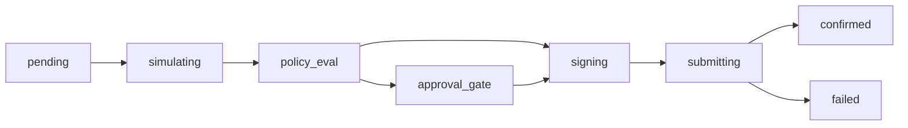

## Response Envelope

All API responses are wrapped in a standardized envelope for consistent error handling and observability. This allows clients to handle responses uniformly across all endpoints.

## Envelope Structure

<ResponseField name="status" type="enum" required>
  Operation result: `success` or `failure`
</ResponseField>

<ResponseField name="errorCode" type="enum">
  Machine-readable error code when `status` is `failure`. One of:
  - `VALIDATION_ERROR` - Invalid request parameters
  - `POLICY_VIOLATION` - Policy denied the operation
  - `PIPELINE_ERROR` - Internal processing failure
  - `CONFIRMATION_FAILED` - Transaction confirmation failed
  - `null` - No error (success)
</ResponseField>

<ResponseField name="failedAt" type="enum">
  Pipeline stage where failure occurred:
  - `validation` - Request validation
  - `policy` - Policy evaluation
  - `build` - Transaction building
  - `sign` - Signing operation
  - `send` - Network submission
  - `confirm` - Confirmation timeout/failure
  - `gateway` - Gateway-level error
  - `null` - No failure
</ResponseField>

<ResponseField name="stage" type="enum" required>
  Current or final pipeline stage:
  - `validation`
  - `policy`
  - `build`
  - `sign`
  - `send`
  - `confirm`
  - `completed`
  - `gateway`
</ResponseField>

<ResponseField name="traceId" type="string" required>
  Unique request identifier (UUID) for debugging and audit correlation
</ResponseField>

<ResponseField name="data" type="object">
  The actual response payload (present on success)
</ResponseField>

<ResponseField name="error" type="string">
  Human-readable error message (present on failure)
</ResponseField>

<ResponseField name="errorMessage" type="string">
  Alternative error message field (some endpoints)
</ResponseField>

## Success Response Example

```json
{
  "status": "success",
  "errorCode": null,
  "failedAt": null,
  "stage": "completed",
  "traceId": "a1b2c3d4-e5f6-7890-abcd-ef1234567890",
  "data": {
    "id": "550e8400-e29b-41d4-a716-446655440000",
    "publicKey": "7xKLvUhXW9XqHZzN3Jw8wVHGK6R4tN2gqV9mP3kL5eXy",
    "provider": "local-dev",
    "status": "active",
    "createdAt": "2026-03-08T12:00:00.000Z"
  }
}
```

## Error Response Example

```json
{
  "status": "failure",
  "errorCode": "VALIDATION_ERROR",
  "failedAt": "validation",
  "stage": "validation",
  "traceId": "b2c3d4e5-f6a7-8901-bcde-f01234567891",
  "error": "Invalid walletId format: expected UUID",
  "data": null
}
```

## Transaction-Specific Behavior

<Info>
  Transaction endpoints may return HTTP 200 with `status: "failure"` when the transaction itself fails after being created.
</Info>

Example - Transaction failed during confirmation:

**Request:**
```bash
curl -H "x-api-key: dev-api-key" \
     http://localhost:3000/api/v1/transactions/123e4567-e89b-12d3-a456-426614174000
```

**Response (HTTP 200):**
```json
{
  "status": "failure",
  "errorCode": "CONFIRMATION_FAILED",
  "failedAt": "confirm",
  "stage": "confirm",
  "traceId": "c3d4e5f6-a7b8-9012-cdef-012345678902",
  "data": {
    "id": "123e4567-e89b-12d3-a456-426614174000",
    "status": "failed",
    "walletId": "550e8400-e29b-41d4-a716-446655440000",
    "type": "transfer_sol",
    "protocol": "system-program",
    "stage": "confirm",
    "error": "Transaction confirmation timeout after 60 seconds"
  }
}
```

<Warning>
  Always check the envelope `status` field, not just the HTTP status code, to determine operation success.
</Warning>

## Client Handling

### TypeScript Example

```typescript
interface ApiEnvelope<T> {
  status: 'success' | 'failure';
  errorCode?: 'VALIDATION_ERROR' | 'POLICY_VIOLATION' | 'PIPELINE_ERROR' | 'CONFIRMATION_FAILED';
  failedAt?: string;
  stage: string;
  traceId: string;
  data?: T;
  error?: string;
  errorMessage?: string;
}

async function handleApiCall<T>(response: Response): Promise<T> {
  const envelope: ApiEnvelope<T> = await response.json();
  
  if (envelope.status === 'failure') {
    throw new Error(
      `API Error [${envelope.errorCode}] at ${envelope.failedAt}: ${
        envelope.error || envelope.errorMessage
      } (trace: ${envelope.traceId})`
    );
  }
  
  return envelope.data!;
}
```

### Python Example

```python
import requests

class ApiError(Exception):
    def __init__(self, envelope):
        self.error_code = envelope.get('errorCode')
        self.failed_at = envelope.get('failedAt')
        self.trace_id = envelope.get('traceId')
        message = envelope.get('error') or envelope.get('errorMessage')
        super().__init__(
            f"API Error [{self.error_code}] at {self.failed_at}: {message} (trace: {self.trace_id})"
        )

def handle_api_call(response):
    envelope = response.json()
    
    if envelope['status'] == 'failure':
        raise ApiError(envelope)
    
    return envelope['data']

# Usage
response = requests.get(
    'http://localhost:3000/api/v1/wallets',
    headers={'x-api-key': 'dev-api-key'}
)
data = handle_api_call(response)
```

## Error Code Reference

<Tabs>
  <Tab title="VALIDATION_ERROR">
    **When:** Invalid request parameters, missing required fields, malformed data
    
    **HTTP Status:** 400 Bad Request (usually)
    
    **Example Scenarios:**
    - Invalid UUID format
    - Missing required fields
    - Out of range values
    - Schema validation failures
    - Invalid API key
    - Missing authentication headers
    
    **Retry:** No - fix the request parameters
  </Tab>
  <Tab title="POLICY_VIOLATION">
    **When:** Policy engine denied the operation
    
    **HTTP Status:** 403 Forbidden or 200 OK (for transactions)
    
    **Example Scenarios:**
    - Spending limit exceeded
    - Destination address not in allowlist
    - Protocol not permitted
    - Slippage above maximum
    - Rate limit exceeded
    - Time window restriction
    
    **Retry:** No - adjust policy rules or wait for policy window
  </Tab>
  <Tab title="PIPELINE_ERROR">
    **When:** Internal processing failure in transaction pipeline
    
    **HTTP Status:** 500 Internal Server Error or 200 OK (for transactions)
    
    **Example Scenarios:**
    - RPC connection failure
    - Transaction simulation failed
    - Signing service unavailable
    - Protocol adapter error
    - Build instruction failure
    
    **Retry:** Yes - transient errors may resolve
  </Tab>
  <Tab title="CONFIRMATION_FAILED">
    **When:** Transaction submitted but confirmation failed or timed out
    
    **HTTP Status:** 200 OK (transaction created but failed)
    
    **Example Scenarios:**
    - Confirmation timeout
    - Transaction dropped from mempool
    - Insufficient SOL for fees
    - On-chain program error
    - Network congestion
    
    **Retry:** Use `/transactions/:txId/retry` endpoint
  </Tab>
</Tabs>

## Stage Progression

Transaction processing follows these stages:



The `stage` field reflects the current or final stage in this progression.

## Trace ID Usage

The `traceId` field is essential for debugging:

1. **Log Correlation** - Search logs for specific request traces
2. **Support Tickets** - Include trace ID when reporting issues
3. **Audit Trails** - Link audit events to originating requests
4. **Distributed Tracing** - Track requests across services

```bash
# Search logs for a specific trace
grep "a1b2c3d4-e5f6-7890-abcd-ef1234567890" /var/log/agentic-wallet/*.log
```

## Best Practices

<Check>
  Always parse the response envelope before accessing `data`
</Check>

<Check>
  Check `status === 'success'` before proceeding with business logic
</Check>

<Check>
  Log `traceId` for all errors to facilitate debugging
</Check>

<Check>
  Handle `errorCode` types differently based on retry eligibility
</Check>

<Check>
  For transactions, poll the status endpoint until `stage` reaches `confirmed` or `failed`
</Check>