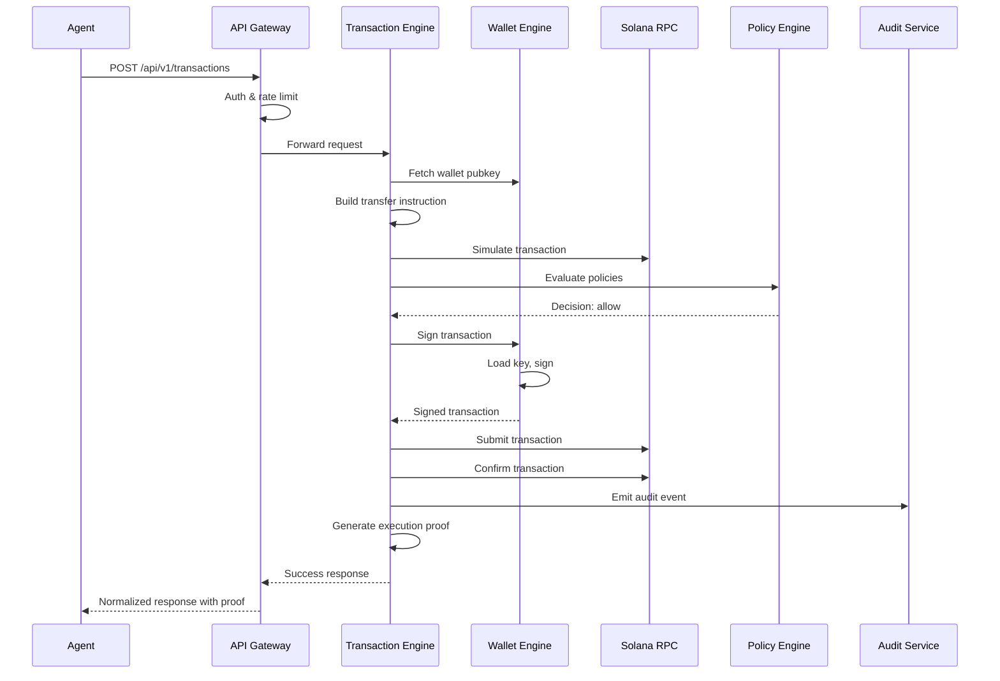

## System Architecture

Agentic Wallet is built as a **gateway + multi-service execution system** where AI agents express intents, and the platform handles validation, policy enforcement, transaction construction, signing, and confirmation.

### Core Principle

<Note>
  Agents do not directly hold private keys and do not submit raw RPC transactions by themselves. All execution flows through controlled boundaries with policy gates and signing isolation.
</Note>

## High-Level Flow

```text
Agent / CLI / SDK / MCP
          |
          v
   API Gateway (auth/scope/rate-limit, stable error envelope)
          |
          v
Transaction Engine
  -> build/simulate
  -> policy_eval / approval_gate
  -> sign boundary (wallet-engine)
  -> submit / confirm
  -> proof + audit + metrics
          |
          v
Solana RPC / Protocol Programs
```

## System Diagram

<CardGroup cols={2}>
  <Card title="Entry Layer" icon="door-open">
    - API Gateway (Port 3000)
    - Authentication & Rate Limiting
    - Route-based scoping
    - Response normalization
  </Card>

  <Card title="Execution Layer" icon="gears">
    - Transaction Engine (Port 3006)
    - Wallet Engine (Port 3002)
    - Policy Engine (Port 3003)
    - Agent Runtime (Port 3004)
  </Card>

  <Card title="Protocol Layer" icon="plug">
    - Protocol Adapters (Port 3005)
    - 7 protocol integrations
    - Adapter registry pattern
    - Real Anchor escrow program
  </Card>

  <Card title="Observability Layer" icon="chart-line">
    - Audit & Observability (Port 3007)
    - MCP Server (Port 3008)
    - Execution proofs
    - Metrics aggregation
  </Card>
</CardGroup>

## Key Architectural Decisions

### 1. Intent-Based Execution Model

Agents express **high-level intents** rather than constructing raw transactions:

- **Agent sends:** `{ type: "swap", protocol: "jupiter", intent: { inputMint, outputMint, amount } }`
- **Platform handles:** Quote fetching, transaction building, simulation, policy checks, signing, submission

This creates a **security boundary** where agents cannot bypass safety controls.

### 2. Multi-Service Separation of Concerns

Each service has a single responsibility:

| Service | Responsibility | Trust Level |
|---------|----------------|-------------|
| `api-gateway` | Auth, routing, rate limiting | Entry point |
| `wallet-engine` | Key custody, signing | **Highest trust** |
| `policy-engine` | Policy evaluation | Safety critical |
| `transaction-engine` | Orchestration, simulation | Execution coordinator |
| `agent-runtime` | Agent lifecycle, capabilities | Agent governance |
| `protocol-adapters` | Protocol-specific logic | Protocol boundary |
| `audit-observability` | Audit stream, metrics | Forensics |
| `mcp-server` | MCP tools, agent integration | Agent interface |

### 3. Fail-Secure Policy Gates

<Steps>
  <Step title="Build Transaction">
    Construct unsigned transaction using protocol adapters
  </Step>
  <Step title="Simulate">
    Run simulation against Solana RPC to validate execution
  </Step>
  <Step title="Policy Evaluation">
    Evaluate against wallet policies and risk controls
  </Step>
  <Step title="Approval Gate (if needed)">
    Pause execution for manual approval when policy requires it
  </Step>
  <Step title="Sign">
    Only after all checks pass, wallet-engine signs the transaction
  </Step>
  <Step title="Submit & Confirm">
    Submit to RPC and wait for confirmation
  </Step>
  <Step title="Generate Proof">
    Create deterministic execution proof with hashes
  </Step>
</Steps>

If **any step fails**, execution stops and no transaction is signed or submitted.

### 4. Pluggable Signer Backends

The wallet-engine supports multiple key custody strategies:

- **`encrypted-file`**: AES-256-GCM encrypted keys on disk (development)
- **`memory`**: Ephemeral in-memory keys (testing)
- **`kms`**: Centralized key management service integration
- **`hsm`**: Hardware security module integration
- **`mpc`**: Multi-party computation with threshold signatures

All backends implement the same `KeyProvider` interface, allowing custody strategy to be swapped via environment configuration.

### 5. Durable Outbox Pattern

The transaction-engine uses a **durable outbox queue** with:

- SQLite-backed persistence
- Lease/retry semantics with configurable max attempts
- Restart recovery drain to handle process crashes
- Idempotency keys to prevent duplicate execution

This ensures transactions survive service restarts and transient failures.

### 6. RPC Failover Pool

Solana RPC operations use a **health-scored pool** with:

- Multiple endpoint URLs (configurable via `SOLANA_RPC_POOL_URLS`)
- Health probing with score decay on failures
- Automatic failover to healthy endpoints
- Adaptive priority fee and compute budget tuning

This provides resilience against single RPC endpoint failures.

## Technology Stack

<Accordion title="Runtime & Framework">
  - **Node.js** >= 20
  - **TypeScript** for type safety
  - **Hono** for HTTP services
  - **Zod** for schema validation
</Accordion>

<Accordion title="Blockchain">
  - **Solana Web3.js** for RPC interactions
  - **SPL Token** for token operations
  - **Anchor** for on-chain program development (escrow)
</Accordion>

<Accordion title="Storage">
  - **SQLite** for durable state (wallets, policies, transactions, agents, outbox)
  - JSON file fallback for simple stores
</Accordion>

<Accordion title="Cryptography">
  - **crypto** (Node.js) for AES-256-GCM encryption
  - **scrypt** for key derivation
  - **Ed25519** signatures (Solana keypairs)
</Accordion>

## Data Flow Example: Simple Transfer



## Scalability & Deployment

### Current State (Prototype)

- **Single-node deployment**: All services run on one machine
- **SQLite persistence**: Suitable for prototype and small-scale deployments
- **In-process communication**: Services communicate via HTTP on localhost

### Production Path

<CardGroup cols={2}>
  <Card title="Horizontal Scaling" icon="arrows-left-right">
    - Replace SQLite with PostgreSQL
    - Introduce distributed queue (Redis, RabbitMQ)
    - Load balance API Gateway instances
    - Scale execution services independently
  </Card>

  <Card title="High Availability" icon="shield-check">
    - Multi-region RPC pool
    - Replicated database with failover
    - Circuit breakers for external APIs
    - Health checks and auto-recovery
  </Card>
</CardGroup>

## Security Posture

<Note>
  Agent intent is **untrusted** until it survives validation, risk evaluation, policy checks, and signing-boundary controls.
</Note>

### Defense in Depth

1. **API Gateway**: Authentication, authorization, rate limiting
2. **Schema Validation**: Zod schemas reject malformed inputs at service edges
3. **Protocol Risk**: Protocol-specific risk controls (slippage, pool concentration, oracle checks)
4. **Policy Engine**: User-defined rules (spending limits, allowlists, rate limits)
5. **Simulation**: Pre-execution validation against Solana RPC
6. **Signing Boundary**: Only wallet-engine can sign, agents never see keys
7. **Delta Guard**: Post-execution balance verification
8. **Audit Stream**: Immutable audit log with execution proofs

See [Trust Boundaries](/architecture/trust-boundaries) for detailed security architecture.

## Next Steps

<CardGroup cols={2}>
  <Card title="Services Deep Dive" icon="server" href="/architecture/services">
    Detailed breakdown of each service's responsibilities and APIs
  </Card>

  <Card title="Execution Flow" icon="diagram-project" href="/architecture/execution-flow">
    Transaction and escrow lifecycle with state machines
  </Card>

  <Card title="Trust Boundaries" icon="shield-halved" href="/architecture/trust-boundaries">
    Security model and control boundaries
  </Card>

  <Card title="API Reference" icon="code" href="/api/overview">
    Complete API documentation for all services
  </Card>
</CardGroup>