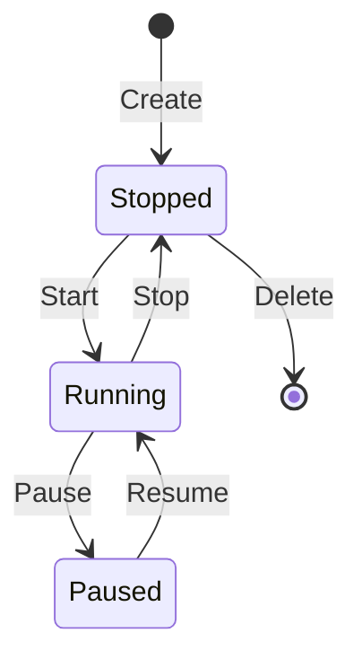

# Agents

Agents are autonomous or supervised actors that execute transactions on behalf of wallets. They provide fine-grained capability control, budget management, and execution automation.

## Agent Structure

```typescript
interface Agent {
  id: string;                           // UUID agent identifier
  name: string;                         // Human-readable name
  walletId: string;                     // Associated wallet UUID
  status: 'stopped' | 'running' | 'paused';
  executionMode: 'autonomous' | 'supervised';
  allowedIntents: TransactionType[];    // Intent allowlist
  autonomy?: AutonomousConfig;          // Autonomous behavior config
  capabilityManifest?: CapabilityManifest; // Cryptographic capability proof
  budgetLamports?: number;              // Spending budget
  pausedReason?: string;                // Reason for pause state
  createdAt: string;
  updatedAt: string;
}
```

## Agent States

Agents transition through well-defined lifecycle states:

<CardGroup cols={3}>
  <Card title="Stopped" icon="stop">
    **Initial State**
    
    Agent created but not executing. Scheduler is inactive.
  </Card>
  
  <Card title="Running" icon="play">
    **Active Execution**
    
    Scheduler active, agent can execute intents based on mode.
  </Card>
  
  <Card title="Paused" icon="pause">
    **Suspended**
    
    Temporarily disabled. Stores reason for audit trail.
  </Card>
</CardGroup>

### State Transitions



## Execution Modes

### Autonomous Mode

Agents execute intents automatically based on rules and steps:

```json
{
  "name": "DCA Trading Bot",
  "executionMode": "autonomous",
  "allowedIntents": ["swap", "query_balance"],
  "autonomy": {
    "enabled": true,
    "mode": "execute",
    "cadenceSeconds": 30,
    "maxActionsPerHour": 60,
    "steps": [
      {
        "id": "dca-swap",
        "type": "swap",
        "protocol": "jupiter",
        "intent": {
          "inputMint": "So11111111111111111111111111111111111111112",
          "outputMint": "EPjFWdd5AufqSSqeM2qN1xzybapC8G4wEGGkZwyTDt1v",
          "amount": "1000000",
          "slippageBps": 50
        },
        "cooldownSeconds": 3600,
        "maxRuns": 24
      }
    ],
    "rules": [
      {
        "id": "low-balance-check",
        "when": [
          { "metric": "balance_lamports", "op": "lt", "value": 1000000 }
        ],
        "then": {
          "type": "query_balance",
          "protocol": "system-program",
          "intent": {}
        },
        "cooldownSeconds": 60
      }
    ]
  }
}
```

<Accordion title="Autonomous Configuration Fields">
  <ParamField path="enabled" type="boolean" default={false}>
    Enable autonomous execution
  </ParamField>
  
  <ParamField path="mode" type="enum" default="execute">
    Execution mode: `execute` (live) or `paper` (simulation)
  </ParamField>
  
  <ParamField path="cadenceSeconds" type="number" default={30}>
    Scheduler loop interval (max 86,400)
  </ParamField>
  
  <ParamField path="maxActionsPerHour" type="number" default={60}>
    Rate limit for autonomous actions (max 3,600)
  </ParamField>
  
  <ParamField path="steps" type="array">
    Predefined transaction steps to execute
  </ParamField>
  
  <ParamField path="rules" type="array">
    Conditional decision rules (when/then)
  </ParamField>
</Accordion>

### Supervised Mode

Agents require explicit API calls to execute intents:

```json
{
  "name": "Manual Trading Agent",
  "executionMode": "supervised",
  "allowedIntents": ["swap", "transfer_sol"],
  "budgetLamports": 10000000000
}
```

Execute via API:
```bash
curl -X POST http://localhost:3000/api/v1/agents/{agentId}/execute \
  -H "Content-Type: application/json" \
  -d '{
    "type": "swap",
    "protocol": "jupiter",
    "intent": {...}
  }'
```

## Capabilities and Allowlists

### Intent Allowlist

Agents can only execute intents explicitly allowed:

```typescript
allowedIntents: [
  'transfer_sol',
  'transfer_spl',
  'swap',
  'query_balance'
]
```

Attempting a non-allowed intent returns `403 Forbidden`.

### Capability Manifests

Optional cryptographic proof of allowed capabilities:

```typescript
interface CapabilityManifest {
  issuer: string;              // Runtime identifier
  version: string;             // Manifest schema version
  agentId: string;             // Agent UUID
  allowedIntents: TransactionType[];
  allowedProtocols: string[];  // e.g., ["jupiter", "marinade"]
  issuedAt: string;            // ISO-8601 timestamp
  expiresAt: string;           // ISO-8601 expiration
  nonce: string;               // Unique nonce for replay protection
  signature: string;           // HMAC signature
}
```

#### Issuing a Manifest

```bash
npm run cli -- agent manifest-issue <agentId> \
  --intents swap,transfer_sol \
  --protocols jupiter,system-program \
  --ttl 3600
```

<Note>
Manifests are enforced when `AGENT_REQUIRE_MANIFEST=true`. The signature is verified using `AGENT_MANIFEST_SIGNING_SECRET`.
</Note>

## Budget Management

Agents can have spending budgets tracked in lamports:

```typescript
interface Budget {
  agentId: string;
  walletId: string;
  budgetLamports: number;      // Total allocated budget
  spentLamports: number;       // Amount consumed
  remainingLamports: number;   // Available for spending
  lastUpdated: string;
}
```

### Budget Operations

<CodeGroup>
```bash Check Budget
npm run cli -- agent budget <agentId>
```

```bash Allocate Budget
npm run cli -- treasury allocate \
  --target-agent-id <agentId> \
  --lamports 1000000000
```

```bash Rebalance Between Agents
npm run cli -- treasury rebalance \
  --source-agent-id <sourceId> \
  --target-agent-id <targetId> \
  --lamports 500000000
```
</CodeGroup>

### Budget Enforcement

The agent runtime checks budgets before executing spend-capable intents:

```typescript
// services/agent-runtime/src/index.ts:212
const spendingTypes = new Set([
  'transfer_sol', 'transfer_spl', 'swap', 'stake',
  'unstake', 'lend_supply', 'lend_borrow',
  'create_mint', 'mint_token', 'create_escrow',
  // ... more types
]);

if (spendingTypes.has(request.type)) {
  const budgetResult = budgetStore.spend(agent.id, lamports);
  if (!budgetResult.ok) {
    return { status: 403, payload: { error: budgetResult.reason } };
  }
}
```

## Agent Scheduler

When an agent is `running`, the scheduler executes a heartbeat loop:

1. **Fetch wallet context**: Balance, tokens, transactions, positions, escrows, policies
2. **Evaluate autonomy rules**: Check conditions and decide on actions
3. **Execute decisions**: Submit intents if conditions match
4. **Update state**: Track cooldowns, run counts, and execution history

### Heartbeat Context

```typescript
interface HeartbeatContext {
  tick: number;
  walletId: string;
  knownWallets: string[];
  meta: {
    generatedAt: string;
    source: 'agent-runtime';
    executionMode: 'autonomous' | 'supervised';
    autonomy?: {
      decision: {...};
      execution: {...};
    };
  };
  balance: {...};
  tokens: {...};
  recentTransactions: {...};
  openApprovals: {...};
  protocolPositions: {...};
  escrowSummary: {...};
  policySummary: {...};
}
```

### Configuration

```bash
AGENT_LOOP_INTERVAL_MS=5000           # Heartbeat interval
AGENT_REQUIRE_MANIFEST=false          # Enforce manifests
AGENT_REQUIRE_BACKTEST_PASS=false     # Require strategy backtest
AGENT_MANIFEST_SIGNING_SECRET=...     # HMAC secret
AGENT_PAUSE_WEBHOOK_SECRET=...        # Pause endpoint auth
```

## Agent Pause Webhook

External systems can pause agents for safety:

```bash
curl -X POST http://localhost:3000/api/v1/agents/{agentId}/pause \
  -H "x-agent-runtime-secret: your-webhook-secret" \
  -d '{"reason": "Risk threshold exceeded"}'
```

Paused agents:
- Stop scheduler execution
- Reject all intent execution attempts (API and autonomy)
- Store `pausedReason` for audit trail
- Can only be resumed via explicit API call

## Decision Engine

The autonomous decision engine evaluates rules and steps:

```typescript
// services/agent-runtime/src/decision/engine.ts
interface DecisionState {
  stepLastRun: Map<string, number>;    // Cooldown tracking
  stepRunCount: Map<string, number>;   // MaxRuns tracking
  ruleLastRun: Map<string, number>;
  ruleRunCount: Map<string, number>;
}
```

**Decision flow:**
1. Check if autonomy is enabled and agent is running
2. Evaluate all decision rules (when/then)
3. If no rule matches, evaluate steps in order
4. Apply cooldowns and maxRuns limits
5. Return executable decision or null

## Best Practices

<Accordion title="Production Agents">
  1. Always set budgets for autonomous agents
  2. Use manifests with short TTL for high-value operations
  3. Implement monitoring on agent heartbeats
  4. Set conservative `maxActionsPerHour` limits
  5. Use paper mode for testing autonomous strategies
  6. Configure pause webhooks for emergency stops
</Accordion>

<Accordion title="Development">
  1. Start agents in supervised mode for testing
  2. Use query intents to validate context
  3. Test budget exhaustion scenarios
  4. Verify allowlist enforcement
  5. Monitor scheduler loop performance
</Accordion>

<Accordion title="Security">
  1. Never expose agent IDs publicly
  2. Restrict allowedIntents to minimum required
  3. Use allowedProtocols in manifests
  4. Implement proper pauseWebhookSecret rotation
  5. Audit agent creation and capability changes
</Accordion>

## Source Code Reference

Agent functionality is implemented in:

- `services/agent-runtime/src/index.ts` - Main agent service (services/agent-runtime/src/index.ts:1)
- `services/agent-runtime/src/scheduler/scheduler.ts` - Heartbeat scheduler (services/agent-runtime/src/scheduler/scheduler.ts:1)
- `services/agent-runtime/src/decision/engine.ts` - Autonomous decision logic (services/agent-runtime/src/decision/engine.ts:1)
- `services/agent-runtime/src/security/capability-manifest.ts` - Manifest signing/verification (services/agent-runtime/src/security/capability-manifest.ts:1)
- `packages/common/src/schemas/agent.ts` - TypeScript schemas (packages/common/src/schemas/agent.ts:1)