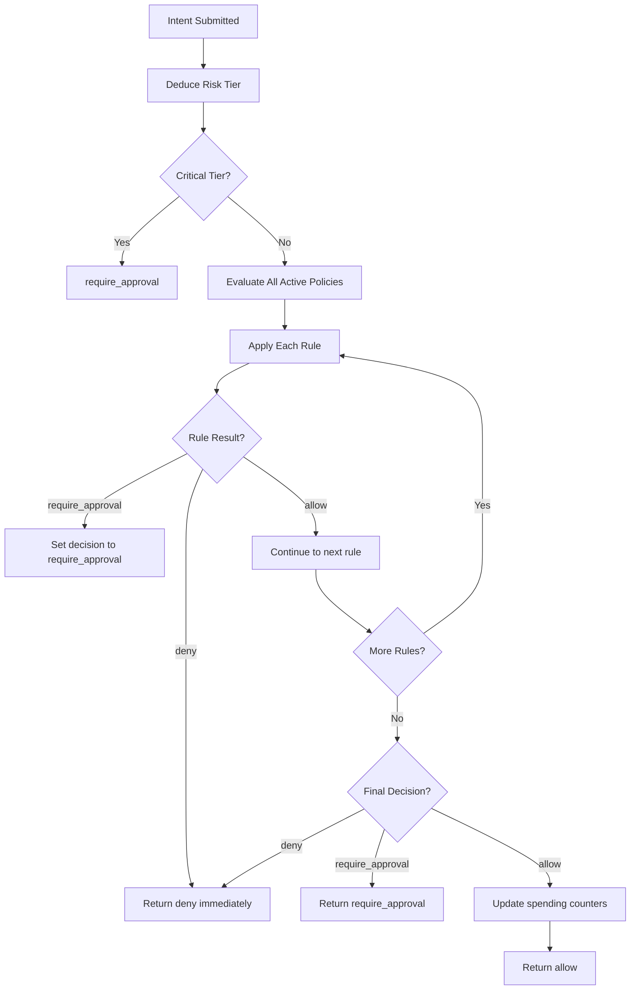

# Policies

Policies are rule-based controls that govern transaction execution. They can allow, deny, or require approval for intents based on flexible criteria.

## Policy Structure

```typescript
interface Policy {
  id: string;              // UUID policy identifier
  walletId: string;        // Associated wallet UUID
  name: string;            // Human-readable name
  version: number;         // Incremental version number
  active: boolean;         // Policy enforcement toggle
  rules: PolicyRule[];     // Array of rule objects
  createdAt: string;       // ISO-8601 creation timestamp
  updatedAt: string;       // ISO-8601 update timestamp
}
```

## Policy Rules

Agentic Wallet supports 11 rule types:

### Spending Limits

```typescript
interface SpendingLimitRule {
  type: 'spending_limit';
  maxLamportsPerTx?: number;           // Per-transaction limit
  maxLamportsPerDay?: number;          // Daily spending cap
  requireApprovalAboveLamports?: number; // Approval threshold
}
```

**Example:**
```json
{
  "type": "spending_limit",
  "maxLamportsPerTx": 1000000000,
  "maxLamportsPerDay": 10000000000,
  "requireApprovalAboveLamports": 500000000
}
```

**Behavior:**
- `maxLamportsPerTx`: Hard limit, transaction denied if exceeded
- `maxLamportsPerDay`: Cumulative daily limit, resets at UTC midnight
- `requireApprovalAboveLamports`: Moves to `approval_gate` status if exceeded

### Address Controls

<CardGroup cols={2}>
  <Card title="Address Allowlist" icon="list-check">
    Only allow transfers to specific addresses.
    
    ```json
    {
      "type": "address_allowlist",
      "addresses": [
        "9B5XszUGdMaxCZ7uSQhPzdks5ZQSmWxrmzCSvtJ6Ns6g",
        "AnotherValidAddress123..."
      ]
    }
    ```
  </Card>
  
  <Card title="Address Blocklist" icon="ban">
    Deny transfers to specific addresses.
    
    ```json
    {
      "type": "address_blocklist",
      "addresses": [
        "KnownScamAddress123...",
        "BlockedAddress456..."
      ]
    }
    ```
  </Card>
</CardGroup>

### Program and Token Controls

<CardGroup cols={2}>
  <Card title="Program Allowlist" icon="code">
    Restrict which Solana programs can be invoked.
    
    ```json
    {
      "type": "program_allowlist",
      "programIds": [
        "11111111111111111111111111111111",
        "TokenkegQfeZyiNwAJbNbGKPFXCWuBvf9Ss623VQ5DA"
      ]
    }
    ```
  </Card>
  
  <Card title="Token Allowlist" icon="coins">
    Restrict token transfers to specific mints.
    
    ```json
    {
      "type": "token_allowlist",
      "mints": [
        "So11111111111111111111111111111111111111112",
        "EPjFWdd5AufqSSqeM2qN1xzybapC8G4wEGGkZwyTDt1v"
      ]
    }
    ```
  </Card>
</CardGroup>

### Protocol Allowlist

```json
{
  "type": "protocol_allowlist",
  "protocols": ["system-program", "jupiter", "marinade"]
}
```

Restricts execution to specific protocol adapters.

### Rate Limiting

```typescript
interface RateLimitRule {
  type: 'rate_limit';
  maxTx: number;          // Maximum transactions
  windowSeconds: number;  // Time window
}
```

**Example:**
```json
{
  "type": "rate_limit",
  "maxTx": 10,
  "windowSeconds": 60
}
```

Limits to 10 transactions per 60-second rolling window.

### Time Windows

```json
{
  "type": "time_window",
  "startHourUtc": 9,
  "endHourUtc": 17
}
```

Only allow transactions during UTC business hours (9 AM - 5 PM).

### Slippage Control

```json
{
  "type": "max_slippage",
  "maxBps": 100
}
```

Reject swaps with slippage exceeding 100 basis points (1%).

### Protocol Risk Rules

```typescript
interface ProtocolRiskRule {
  type: 'protocol_risk';
  protocol: string;
  maxSlippageBps?: number;
  maxPoolConcentrationBps?: number;
  allowedPools?: string[];
  allowedPrograms?: string[];
  oracleDeviationBps?: number;
}
```

**Example:**
```json
{
  "type": "protocol_risk",
  "protocol": "jupiter",
  "maxSlippageBps": 200,
  "oracleDeviationBps": 500,
  "allowedPrograms": [
    "JUP6LkbZbjS1jKKwapdHNy74zcZ3tLUZoi5QNyVTaV4"
  ]
}
```

**Checks:**
- **maxSlippageBps**: Protocol-specific slippage limit
- **maxPoolConcentrationBps**: Reject if pool is too concentrated
- **allowedPools**: Whitelist specific liquidity pools
- **allowedPrograms**: Restrict program IDs for this protocol
- **oracleDeviationBps**: Compare quoted price vs oracle, require approval if deviation exceeds threshold

### Portfolio Risk Rules

```typescript
interface PortfolioRiskRule {
  type: 'portfolio_risk';
  maxDrawdownLamports?: number;
  maxDailyLossLamports?: number;
  maxExposureBpsPerToken?: number;
  maxExposureBpsPerProtocol?: number;
}
```

**Example:**
```json
{
  "type": "portfolio_risk",
  "maxDailyLossLamports": 2000000000,
  "maxExposureBpsPerProtocol": 6000
}
```

**Checks:**
- **maxDailyLossLamports**: Deny if projected loss exceeds limit
- **maxDrawdownLamports**: Deny if drawdown from high-water mark exceeds limit
- **maxExposureBpsPerToken**: Require approval if token concentration > limit (in bps)
- **maxExposureBpsPerProtocol**: Require approval if protocol exposure > limit

<Note>
Portfolio risk checks require the caller to compute projected values and pass them in the evaluation request.
</Note>

## Policy Evaluation

Policies are evaluated before transaction execution:

```typescript
interface PolicyEvaluationRequest {
  walletId: string;
  agentId?: string;
  type: string;                    // Transaction type
  protocol: string;
  destination?: string;
  tokenMint?: string;
  amountLamports?: number;
  programIds?: string[];
  slippageBps?: number;
  pool?: string;
  poolConcentrationBps?: number;
  oraclePriceUsd?: number;
  quotedPriceUsd?: number;
  projectedDailyLossLamports?: number;
  projectedDrawdownLamports?: number;
  projectedTokenExposureBps?: number;
  projectedProtocolExposureBps?: number;
  timestamp?: string;
  riskTierHint?: 'low' | 'medium' | 'high' | 'critical';
}
```

### Evaluation Response

```typescript
interface PolicyDecision {
  decision: 'allow' | 'deny' | 'require_approval';
  reasons: string[];               // Human-readable explanations
  riskTier: 'low' | 'medium' | 'high' | 'critical';
}
```

**Example:**
```json
{
  "decision": "deny",
  "reasons": [
    "Amount 2000000000 exceeds maxLamportsPerTx 1000000000",
    "Protocol opensea not allowed"
  ],
  "riskTier": "high"
}
```

### Evaluation Flow



### Risk Tier Deduction

```typescript
// services/policy-engine/src/engine/policy-evaluator.ts:21
const RESTRICTED_TYPES = new Set([
  'flash_loan_bundle',
  'cpi_call',
  'custom_instruction_bundle'
]);

function deduceRiskTier(input: PolicyEvaluationRequest): RiskTier {
  if (input.riskTierHint) return input.riskTierHint;
  if (RESTRICTED_TYPES.has(input.type)) return 'critical';
  if ((input.amountLamports ?? 0) > 2_000_000_000) return 'high';
  if (input.type.includes('swap') || 
      input.type.includes('lend') || 
      input.type.includes('stake')) return 'medium';
  return 'low';
}
```

**Critical tier** automatically triggers `require_approval`.

## Policy Versioning

Policies use incremental versioning:

```typescript
// On update:
policy.version = policy.version + 1;
policy.updatedAt = new Date().toISOString();
```

### Listing Versions

```bash
npm run cli -- policy versions <policyId>
```

Returns all historical versions of a policy.

### Retrieving Specific Version

```bash
npm run cli -- policy version <policyId> --number 3
```

Returns version 3 of the policy.

## Policy Migration

Migrate policies to new versions with transformations:

```bash
npm run cli -- policy migrate <policyId> \
  --target-version 5 \
  --mode add_default_risk_rules
```

### Migration Modes

<Accordion title="normalize (default)">
  Validate and normalize existing rules without adding new ones.
</Accordion>

<Accordion title="add_default_risk_rules">
  Add default `protocol_risk` and `portfolio_risk` rules if missing:
  
  ```typescript
  // services/policy-engine/src/index.ts:150
  if (!hasProtocolRisk) {
    nextRules.push({
      type: 'protocol_risk',
      protocol: 'jupiter',
      maxSlippageBps: 200,
      oracleDeviationBps: 500,
    });
  }
  if (!hasPortfolioRisk) {
    nextRules.push({
      type: 'portfolio_risk',
      maxDailyLossLamports: 2_000_000_000,
      maxExposureBpsPerProtocol: 6000,
    });
  }
  ```
</Accordion>

## Approval Gates

When a policy returns `require_approval`, the transaction enters `approval_gate` status:

```typescript
status: 'approval_gate'
reasons: [
  "Amount 600000000 is above approval threshold 500000000"
]
```

### Manual Approval

<CodeGroup>
```bash Approve
npm run cli -- tx approve <txId>
```

```bash Reject
npm run cli -- tx reject <txId>
```
</CodeGroup>

Approving resumes the pipeline from the approval gate. Rejecting moves the transaction to `failed` status.

### Pending Approvals

List all transactions awaiting approval:

```bash
npm run cli -- tx pending --wallet-id <walletId>
```

## Compatibility Check

Validate rule compatibility before creating policies:

```bash
npm run cli -- policy compatibility-check \
  --rules '[{"type":"spending_limit","maxLamportsPerTx":1000000000}]'
```

**Response:**
```json
{
  "data": {
    "compatible": true,
    "supportedRuleTypes": [
      "spending_limit",
      "address_allowlist",
      "address_blocklist",
      "program_allowlist",
      "token_allowlist",
      "protocol_allowlist",
      "rate_limit",
      "time_window",
      "max_slippage",
      "protocol_risk",
      "portfolio_risk"
    ],
    "unsupportedRuleTypes": []
  }
}
```

## Policy State Management

The policy evaluator maintains state for stateful rules:

```typescript
// services/policy-engine/src/engine/policy-evaluator.ts:38
class PolicyEvaluator {
  private readonly rateLimitEvents = new Map<string, RateLimitWindow[]>();
  private readonly dailySpendByWallet = new Map<string, number>();
  private readonly snapshotFile: string | undefined;
  
  constructor(snapshotFile?: string) {
    // Load state from disk
    const snapshot = readJsonFile<PolicyEvaluatorSnapshot>(this.snapshotFile);
    // ...
  }
  
  private persist(): void {
    // Save state to disk after each evaluation
    writeJsonFile(this.snapshotFile, {
      rateLimitEvents: [...this.rateLimitEvents.entries()],
      dailySpendByWallet: [...this.dailySpendByWallet.entries()],
    });
  }
}
```

**Persisted state:**
- **rateLimitEvents**: Rolling window of transaction timestamps per wallet/agent
- **dailySpendByWallet**: Cumulative spending per wallet per day (keyed by `walletId:YYYY-MM-DD`)

## Best Practices

<Accordion title="Production Policies">
  1. Always set spending limits for autonomous wallets
  2. Use address allowlists for high-value recipient addresses
  3. Combine multiple rule types for defense in depth
  4. Set rate limits to prevent runaway execution
  5. Use time windows for scheduled operations
  6. Enable protocol_risk rules for DeFi operations
  7. Monitor approval queue length
</Accordion>

<Accordion title="Policy Design">
  1. Start with strict policies and relax as needed
  2. Use `requireApprovalAboveLamports` for human oversight
  3. Test policies with paper trades before live execution
  4. Version policies on every change for audit trail
  5. Document policy intent in the `name` field
  6. Combine protocol_allowlist with protocol_risk for granular control
</Accordion>

<Accordion title="Security">
  1. Never disable all policies on production wallets
  2. Use program_allowlist to prevent malicious contract calls
  3. Set conservative oracle deviation thresholds
  4. Implement portfolio exposure limits
  5. Require approval for critical risk tier operations
  6. Audit policy changes and maintain version history
</Accordion>

## Source Code Reference

Policy functionality is implemented in:

- `services/policy-engine/src/engine/policy-evaluator.ts` - Evaluation engine (services/policy-engine/src/engine/policy-evaluator.ts:1)
- `services/policy-engine/src/index.ts` - Policy API (services/policy-engine/src/index.ts:1)
- `packages/common/src/schemas/policy.ts` - Rule type definitions (packages/common/src/schemas/policy.ts:1)