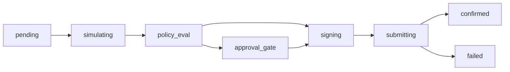

## Overview

Transactions in Agentic Wallet follow a complete lifecycle from creation through confirmation. All transactions are created via **intents** - high-level instructions that the platform translates into protocol-specific on-chain operations.

## Transaction Lifecycle

Every transaction moves through these states:



<Steps>
  <Step title="pending">
    Transaction created and queued for processing
  </Step>
  <Step title="simulating">
    Transaction simulated on-chain to estimate costs and catch errors
  </Step>
  <Step title="policy_eval">
    Policy engine evaluates rules (spending limits, allowlists, etc.)
  </Step>
  <Step title="approval_gate">
    Transaction paused for manual approval (if required by policy)
  </Step>
  <Step title="signing">
    Wallet engine signs the transaction
  </Step>
  <Step title="submitting">
    Transaction submitted to Solana network
  </Step>
  <Step title="confirmed | failed">
    Final state after on-chain confirmation or failure
  </Step>
</Steps>

## Creating Transactions

### Basic Transfer (SOL)

<Tabs>
  <Tab title="CLI">
    ```bash
    npm run cli -- tx create \
      --wallet-id <walletId> \
      --type transfer_sol \
      --protocol system-program \
      --intent '{"destination":"<pubkey>","lamports":1000000}'
    ```
  </Tab>

  <Tab title="API">
    ```bash
    curl -X POST http://localhost:3000/api/v1/transactions \
      -H "Content-Type: application/json" \
      -H "x-api-key: dev-api-key" \
      -d '{
        "walletId": "<walletId>",
        "type": "transfer_sol",
        "protocol": "system-program",
        "intent": {
          "destination": "<destination-pubkey>",
          "lamports": 1000000
        }
      }'
    ```
  </Tab>

  <Tab title="SDK">
    ```typescript
    const tx = await client.transaction.create({
      walletId: walletId,
      type: 'transfer_sol',
      protocol: 'system-program',
      intent: {
        destination: destinationPubkey,
        lamports: 1_000_000
      }
    });

    console.log(`Transaction ID: ${tx.id}`);
    console.log(`Status: ${tx.status}`);
    ```
  </Tab>
</Tabs>

### SPL Token Transfer

<CodeGroup>
  ```json Intent Structure
  {
    "walletId": "<walletId>",
    "type": "transfer_spl",
    "protocol": "spl-token",
    "intent": {
      "destination": "<destination-pubkey>",
      "mint": "EPjFWdd5AufqSSqeM2qN1xzybapC8G4wEGGkZwyTDt1v",
      "amount": "1000000"
    }
  }
  ```

  ```bash CLI
  npm run cli -- tx create \
    --wallet-id <walletId> \
    --type transfer_spl \
    --protocol spl-token \
    --intent '{"destination":"<pubkey>","mint":"<mint>","amount":"1000000"}'
  ```
</CodeGroup>

### Token Swap

<CodeGroup>
  ```json Jupiter Swap
  {
    "walletId": "<walletId>",
    "type": "swap",
    "protocol": "jupiter",
    "intent": {
      "inputMint": "So11111111111111111111111111111111111111112",
      "outputMint": "EPjFWdd5AufqSSqeM2qN1xzybapC8G4wEGGkZwyTDt1v",
      "amount": "1000000",
      "slippageBps": 50
    }
  }
  ```

  ```bash CLI Example
  npm run cli -- protocol swap \
    --protocol jupiter \
    --input-mint So11111111111111111111111111111111111111112 \
    --output-mint EPjFWdd5AufqSSqeM2qN1xzybapC8G4wEGGkZwyTDt1v \
    --amount 1000000 \
    --wallet <walletAddress> \
    --slippage-bps 50
  ```
</CodeGroup>

## Intent Structure

All transactions require these fields:

| Field | Type | Required | Description |
|-------|------|----------|-------------|
| `walletId` | UUID | Yes | Wallet performing the transaction |
| `type` | string | Yes | Transaction type (see supported types below) |
| `protocol` | string | Yes | Protocol adapter to use |
| `intent` | object | Yes | Protocol-specific intent payload |
| `agentId` | UUID | No | Agent executing this transaction |
| `gasless` | boolean | No | Use gasless transaction (if supported) |
| `idempotencyKey` | string | No | Prevent duplicate executions |

### Supported Transaction Types

<AccordionGroup>
  <Accordion title="Transfers & Payments">
    - `transfer_sol` - Transfer native SOL
    - `transfer_spl` - Transfer SPL tokens
    - `x402_pay` - HTTP 402 payment flow
  </Accordion>

  <Accordion title="DeFi Operations">
    - `swap` - Token swaps (Jupiter, Orca, Raydium)
    - `stake` - Stake SOL (Marinade)
    - `unstake` - Unstake SOL
    - `lend_supply` - Supply assets to lending (Solend)
    - `lend_borrow` - Borrow assets from lending
  </Accordion>

  <Accordion title="Token Operations">
    - `create_mint` - Create new SPL token mint
    - `mint_token` - Mint tokens to address
  </Accordion>

  <Accordion title="Escrow Operations">
    - `create_escrow` - Create new escrow
    - `accept_escrow` - Accept escrow as counterparty
    - `release_escrow` - Release funds to recipient
    - `refund_escrow` - Refund to creator
    - `dispute_escrow` - Initiate dispute
    - `resolve_dispute` - Resolve dispute
    - `create_milestone_escrow` - Multi-milestone escrow
    - `release_milestone` - Release specific milestone
  </Accordion>

  <Accordion title="Query Operations (Read-only)">
    - `query_balance` - Check wallet balance
    - `query_positions` - Get DeFi positions
  </Accordion>

  <Accordion title="Advanced">
    - `flash_loan_bundle` - Flash loan operations
    - `cpi_call` - Cross-program invocation
    - `custom_instruction_bundle` - Custom instruction set
    - `treasury_allocate` - Treasury allocation
    - `treasury_rebalance` - Treasury rebalancing
    - `paper_trade` - Paper trading (simulation)
  </Accordion>
</AccordionGroup>

## Polling for Confirmation

Transactions are processed asynchronously. Poll the transaction status:

<CodeGroup>
  ```bash CLI
  npm run cli -- tx get <txId>
  ```

  ```bash API
  curl -H "x-api-key: dev-api-key" \
    http://localhost:3000/api/v1/transactions/<txId>
  ```

  ```typescript SDK
  // Poll until confirmed or failed
  let tx = await client.transaction.get(txId);

  while (!['confirmed', 'failed'].includes(tx.status)) {
    await new Promise(resolve => setTimeout(resolve, 1000));
    tx = await client.transaction.get(txId);
  }

  if (tx.status === 'confirmed') {
    console.log(`Success! Signature: ${tx.signature}`);
  } else {
    console.log(`Failed: ${tx.error}`);
  }
  ```
</CodeGroup>

**Response Structure:**
```json
{
  "status": "success",
  "data": {
    "id": "tx-uuid",
    "walletId": "wallet-uuid",
    "type": "transfer_sol",
    "protocol": "system-program",
    "status": "confirmed",
    "signature": "5j7s...",
    "intent": { ... },
    "createdAt": "2026-03-08T12:00:00.000Z",
    "confirmedAt": "2026-03-08T12:00:05.000Z"
  }
}
```

## Idempotency Keys

Prevent duplicate transaction execution with idempotency keys:

```typescript
const tx = await client.transaction.create({
  walletId: walletId,
  type: 'transfer_sol',
  protocol: 'system-program',
  idempotencyKey: 'payment-invoice-12345',
  intent: {
    destination: destinationPubkey,
    lamports: 1_000_000
  }
});
```

<Note>
  If you submit the same `idempotencyKey` again, the API returns the original transaction instead of creating a duplicate.
</Note>

## Approval Gate Workflow

If a policy requires approval, the transaction pauses at `approval_gate`:

<Steps>
  <Step title="Transaction Paused">
    Transaction reaches `approval_gate` status and waits for operator action.
  </Step>

  <Step title="Review Transaction">
    Retrieve pending approvals:
    ```bash
    npm run cli -- tx pending --wallet-id <walletId>
    ```
  </Step>

  <Step title="Approve or Reject">
    <CodeGroup>
      ```bash Approve
      npm run cli -- tx approve <txId>
      # Or via API:
      curl -X POST -H "x-api-key: dev-api-key" \
        http://localhost:3000/api/v1/transactions/<txId>/approve
      ```

      ```bash Reject
      npm run cli -- tx reject <txId>
      # Or via API:
      curl -X POST -H "x-api-key: dev-api-key" \
        http://localhost:3000/api/v1/transactions/<txId>/reject
      ```
    </CodeGroup>
  </Step>

  <Step title="Transaction Continues">
    After approval, transaction proceeds to `signing` → `submitting` → `confirmed`.
  </Step>
</Steps>

## Transaction Proofs

Every transaction generates cryptographic proof artifacts:

```bash
npm run cli -- tx proof <txId>
```

**Response:**
```json
{
  "intentHash": "sha256-hash-of-intent",
  "policyHash": "sha256-hash-of-policy-eval",
  "simulationHash": "sha256-hash-of-simulation",
  "proofHash": "combined-proof-hash",
  "signature": "on-chain-signature",
  "timestamp": "2026-03-08T12:00:00.000Z"
}
```

## Replay Data

Get full execution replay for auditing:

```bash
npm run cli -- tx replay <txId>
```

Returns complete transaction history including all state transitions and policy decisions.

## Gasless Transactions

Enable gasless execution for supported protocols:

```typescript
const tx = await client.transaction.create({
  walletId: walletId,
  type: 'swap',
  protocol: 'jupiter',
  gasless: true, // Route through Kora RPC
  intent: { ... }
});
```

<Warning>
  Gasless execution requires `KORA_RPC_URL` configured and protocol must have `gaslessEligible: true` in risk config.
</Warning>

## Real Examples from Source

### From `scripts/devnet-smoke.ts`

```typescript
import 'dotenv/config';
import { Connection, Keypair, PublicKey, SystemProgram, Transaction } from '@solana/web3.js';

const apiBase = 'http://localhost:3000';
const apiKey = 'dev-api-key';

// Create wallet
const createRes = await fetch(`${apiBase}/api/v1/wallets`, {
  method: 'POST',
  headers: { 'content-type': 'application/json', 'x-api-key': apiKey },
  body: JSON.stringify({ label: 'smoke-wallet' })
});

const wallet = await createRes.json();

// Execute transfer
const transferRes = await fetch(`${apiBase}/api/v1/transactions`, {
  method: 'POST',
  headers: { 'content-type': 'application/json', 'x-api-key': apiKey },
  body: JSON.stringify({
    walletId: wallet.data.id,
    type: 'transfer_sol',
    protocol: 'system-program',
    gasless: false,
    intent: {
      destination: destinationPubkey,
      lamports: 1_000_000
    }
  })
});

const tx = await transferRes.json();
console.log(`Transaction status: ${tx.data.status}`);
```

## Next Steps

<CardGroup cols={2}>
  <Card title="Setting Policies" icon="shield" href="/guides/setting-policies">
    Add spending limits and security rules to your transactions
  </Card>
  <Card title="Protocol Interactions" icon="plug" href="/guides/protocol-interactions">
    Execute DeFi operations across Jupiter, Marinade, Solend, and more
  </Card>
</CardGroup>
