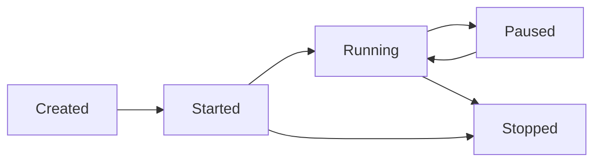

## Overview

Agents are autonomous executors that can perform transactions on behalf of wallets. They operate with **capability-gated** permissions, **budget controls**, and support both **autonomous** and **supervised** execution modes.

## Agent Lifecycle

Agents move through these states:



## Creating Agents

<Tabs>
  <Tab title="CLI">
    ### Basic Agent

    ```bash
    npm run cli -- agent create my-trader \
      --wallet-id <walletId> \
      --mode autonomous \
      --intents transfer_sol query_balance
    ```

    ### With Budget

    ```bash
    npm run cli -- agent create yield-farmer \
      --wallet-id <walletId> \
      --mode supervised \
      --intents swap stake unstake query_positions
    ```
  </Tab>

  <Tab title="API">
    ```bash
    curl -X POST http://localhost:3000/api/v1/agents \
      -H "Content-Type: application/json" \
      -H "x-api-key: dev-api-key" \
      -d '{
        "name": "trading-bot",
        "walletId": "<walletId>",
        "executionMode": "autonomous",
        "allowedIntents": ["transfer_sol", "query_balance"],
        "budgetLamports": 10000000
      }'
    ```
  </Tab>

  <Tab title="SDK">
    ```typescript
    const agent = await client.agent.create({
      name: 'trading-bot',
      walletId: walletId,
      executionMode: 'autonomous',
      allowedIntents: ['transfer_sol', 'swap', 'query_balance'],
      budgetLamports: 10_000_000
    });

    console.log(`Agent ID: ${agent.id}`);
    console.log(`Status: ${agent.status}`);
    ```
  </Tab>
</Tabs>

## Execution Modes

### Autonomous Mode

Agent executes transactions automatically based on its decision engine:

```json
{
  "name": "auto-trader",
  "executionMode": "autonomous",
  "autonomy": {
    "enabled": true,
    "mode": "execute",
    "cadenceSeconds": 30,
    "maxActionsPerHour": 60,
    "steps": [
      {
        "id": "step-1",
        "type": "swap",
        "protocol": "jupiter",
        "intent": {
          "inputMint": "So11111111111111111111111111111111111111112",
          "outputMint": "EPjFWdd5AufqSSqeM2qN1xzybapC8G4wEGGkZwyTDt1v",
          "amount": "1000000",
          "slippageBps": 50
        },
        "cooldownSeconds": 30,
        "maxRuns": 100
      }
    ],
    "rules": [
      {
        "id": "rule-1",
        "when": [
          {
            "metric": "balance_lamports",
            "op": "lt",
            "value": 1000000
          }
        ],
        "then": {
          "type": "query_balance",
          "protocol": "system-program",
          "intent": {}
        },
        "cooldownSeconds": 60
      }
    ]
  }
}
```

### Supervised Mode

Agent requires explicit approval for each transaction:

```json
{
  "name": "supervised-bot",
  "executionMode": "supervised",
  "allowedIntents": ["swap", "stake"]
}
```

In supervised mode, all transactions pause at `approval_gate` regardless of policies.

## Setting Capabilities

Control which intents and protocols an agent can use:

<CodeGroup>
  ```bash CLI
  npm run cli -- agent caps-set <agentId> \
    --intents transfer_sol swap stake query_balance \
    --mode autonomous
  ```

  ```bash API
  curl -X PUT http://localhost:3000/api/v1/agents/<agentId>/capabilities \
    -H "Content-Type: application/json" \
    -H "x-api-key: dev-api-key" \
    -d '{
      "allowedIntents": ["transfer_sol", "swap", "stake"],
      "executionMode": "autonomous"
    }'
  ```

  ```typescript SDK
  await client.agent.setCapabilities(agentId, {
    allowedIntents: ['transfer_sol', 'swap', 'stake', 'query_balance'],
    executionMode: 'autonomous'
  });
  ```
</CodeGroup>

## Capability Manifests

Manifests are signed, time-limited capability certificates:

<Steps>
  <Step title="Issue Manifest">
    Create a signed capability manifest:

    ```bash
    npm run cli -- agent manifest-issue <agentId> \
      --intents transfer_sol swap \
      --protocols system-program jupiter \
      --ttl 3600
    ```

    **Response:**
    ```json
    {
      "manifestId": "manifest-uuid",
      "agentId": "agent-uuid",
      "allowedIntents": ["transfer_sol", "swap"],
      "allowedProtocols": ["system-program", "jupiter"],
      "issuedAt": "2026-03-08T12:00:00.000Z",
      "expiresAt": "2026-03-08T13:00:00.000Z",
      "signature": "manifest-signature"
    }
    ```
  </Step>

  <Step title="Verify Manifest">
    Verify a manifest's authenticity:

    ```bash
    npm run cli -- agent manifest-verify <agentId> \
      --manifest '{"manifestId":"...","signature":"..."}'
    ```

    Or from file:
    ```bash
    npm run cli -- agent manifest-verify <agentId> \
      --manifest-file manifest.json
    ```
  </Step>

  <Step title="Execute with Manifest">
    The agent runtime enforces manifest permissions at execution time.
  </Step>
</Steps>

<Note>
  Manifests require `AGENT_MANIFEST_SIGNING_SECRET` and `AGENT_MANIFEST_ISSUER` configured. Set `AGENT_REQUIRE_MANIFEST=true` to enforce manifest validation.
</Note>

## Budget Operations

Manage agent spending budgets:

### Check Budget

<CodeGroup>
  ```bash CLI
  npm run cli -- agent budget <agentId>
  ```

  ```bash API
  curl -H "x-api-key: dev-api-key" \
    http://localhost:3000/api/v1/agents/<agentId>/budget
  ```

  ```typescript SDK
  const budget = await client.agent.budget(agentId);
  console.log(`Remaining: ${budget.remainingLamports} lamports`);
  ```
</CodeGroup>

**Response:**
```json
{
  "agentId": "agent-uuid",
  "budgetLamports": 10000000,
  "spentLamports": 2500000,
  "remainingLamports": 7500000,
  "lastResetAt": "2026-03-08T00:00:00.000Z"
}
```

### Allocate Budget

```bash
npm run cli -- treasury allocate \
  --target-agent-id <agentId> \
  --lamports 5000000 \
  --reason "Monthly allocation"
```

### Rebalance Between Agents

```bash
npm run cli -- treasury rebalance \
  --source-agent-id <agentA> \
  --target-agent-id <agentB> \
  --lamports 1000000 \
  --reason "Rebalance budgets"
```

## Agent Lifecycle Management

### Start Agent

<CodeGroup>
  ```bash CLI
  npm run cli -- agent start <agentId>
  ```

  ```bash API
  curl -X POST -H "x-api-key: dev-api-key" \
    http://localhost:3000/api/v1/agents/<agentId>/start
  ```

  ```typescript SDK
  await client.agent.start(agentId);
  ```
</CodeGroup>

### Stop Agent

<CodeGroup>
  ```bash CLI
  npm run cli -- agent stop <agentId>
  ```

  ```bash API
  curl -X POST -H "x-api-key: dev-api-key" \
    http://localhost:3000/api/v1/agents/<agentId>/stop
  ```

  ```typescript SDK
  await client.agent.stop(agentId);
  ```
</CodeGroup>

### Pause Agent

<CodeGroup>
  ```bash CLI
  npm run cli -- agent pause <agentId> --reason "Manual review"
  ```

  ```bash API
  curl -X POST http://localhost:3000/api/v1/agents/<agentId>/pause \
    -H "Content-Type: application/json" \
    -H "x-api-key: dev-api-key" \
    -d '{"reason": "Manual review"}'
  ```

  ```typescript SDK
  await client.agent.pause(agentId, { reason: 'Manual review' });
  ```
</CodeGroup>

### Resume Agent

<CodeGroup>
  ```bash CLI
  npm run cli -- agent resume <agentId>
  ```

  ```bash API
  curl -X POST -H "x-api-key: dev-api-key" \
    http://localhost:3000/api/v1/agents/<agentId>/resume
  ```

  ```typescript SDK
  await client.agent.resume(agentId);
  ```
</CodeGroup>

## Executing Agent Transactions

Manually trigger agent execution:

<CodeGroup>
  ```bash CLI
  npm run cli -- agent exec <agentId> \
    --type swap \
    --protocol jupiter \
    --intent '{
      "inputMint": "So11111111111111111111111111111111111111112",
      "outputMint": "EPjFWdd5AufqSSqeM2qN1xzybapC8G4wEGGkZwyTDt1v",
      "amount": "1000000",
      "slippageBps": 50
    }'
  ```

  ```bash API
  curl -X POST http://localhost:3000/api/v1/agents/<agentId>/execute \
    -H "Content-Type: application/json" \
    -H "x-api-key: dev-api-key" \
    -d '{
      "type": "swap",
      "protocol": "jupiter",
      "intent": {
        "inputMint": "So11111111111111111111111111111111111111112",
        "outputMint": "EPjFWdd5AufqSSqeM2qN1xzybapC8G4wEGGkZwyTDt1v",
        "amount": "1000000",
        "slippageBps": 50
      }
    }'
  ```

  ```typescript SDK
  const tx = await client.agent.execute(agentId, {
    type: 'swap',
    protocol: 'jupiter',
    intent: {
      inputMint: 'So11111111111111111111111111111111111111112',
      outputMint: 'EPjFWdd5AufqSSqeM2qN1xzybapC8G4wEGGkZwyTDt1v',
      amount: '1000000',
      slippageBps: 50
    }
  });
  ```
</CodeGroup>

## Autonomy Configuration

Configure autonomous decision-making:

### Decision Rules

Rules trigger actions based on conditions:

```json
{
  "rules": [
    {
      "id": "low-balance-alert",
      "when": [
        {
          "metric": "balance_lamports",
          "op": "lt",
          "value": 1000000
        }
      ],
      "then": {
        "type": "query_balance",
        "protocol": "system-program",
        "intent": {}
      },
      "cooldownSeconds": 60
    }
  ]
}
```

Supported operators: `lt`, `lte`, `gt`, `gte`, `eq`, `ne`

Supported metrics:
- `balance_lamports`
- `token_balance`
- `position_value`
- `daily_pnl`
- `price_deviation`

### Strategy Steps

Steps define recurring autonomous actions:

```json
{
  "steps": [
    {
      "id": "daily-rebalance",
      "type": "swap",
      "protocol": "jupiter",
      "intent": {
        "inputMint": "So11111111111111111111111111111111111111112",
        "outputMint": "EPjFWdd5AufqSSqeM2qN1xzybapC8G4wEGGkZwyTDt1v",
        "amount": "1000000",
        "slippageBps": 50
      },
      "cooldownSeconds": 86400,
      "maxRuns": 30
    }
  ]
}
```

## Paper Trading & Backtesting

### Execute Paper Trade

Test strategies without real funds:

```bash
npm run cli -- strategy paper-execute \
  --agent-id <agentId> \
  --wallet-id <walletId> \
  --type swap \
  --protocol jupiter \
  --intent '{...}'
```

### Backtest Strategy

Replay historical strategy:

```bash
npm run cli -- strategy backtest \
  --wallet-id <walletId> \
  --name "Q1 Strategy" \
  --steps '[
    {
      "type": "query_balance",
      "protocol": "system-program",
      "intent": {},
      "timestamp": "2026-01-01T00:00:00.000Z"
    },
    {
      "type": "swap",
      "protocol": "jupiter",
      "intent": {...},
      "timestamp": "2026-01-02T00:00:00.000Z"
    }
  ]' \
  --minimum-pass-rate 0.7
```

### List Paper Trades

```bash
npm run cli -- strategy paper-list <agentId>
```

## Real Examples from Source

### From `scripts/devnet-multi-agent.ts`

```typescript
import { createAgenticWalletClient } from '@agentic-wallet/sdk';

const client = createAgenticWalletClient('http://localhost:3000', {
  apiKey: 'dev-api-key'
});

// Create wallet
const wallet = await client.wallet.create({ label: 'multi-agent-wallet' });

// Create agent
const agent = await client.agent.create({
  name: 'trader-bot',
  walletId: wallet.id,
  executionMode: 'autonomous',
  allowedIntents: ['transfer_sol', 'query_balance'],
  budgetLamports: 5_000_000
});

// Execute transaction
const tx = await fetch(`http://localhost:3000/api/v1/agents/${agent.id}/execute`, {
  method: 'POST',
  headers: {
    'content-type': 'application/json',
    'x-api-key': 'dev-api-key'
  },
  body: JSON.stringify({
    type: 'transfer_sol',
    protocol: 'system-program',
    intent: {
      destination: destinationPubkey,
      lamports: 1_000_000
    }
  })
});
```

## Agent Security

<Warning>
  **Security Best Practices:**
  - Always set `budgetLamports` to limit agent spending
  - Use `supervised` mode for high-value operations
  - Restrict `allowedIntents` to minimum necessary
  - Enable `AGENT_REQUIRE_MANIFEST=true` in production
  - Set `AGENT_REQUIRE_BACKTEST_PASS=true` to require strategy validation
  - Use capability manifests with short TTL for time-limited operations
</Warning>

### Governance Controls

```bash
# Environment configuration
AGENT_MANIFEST_SIGNING_SECRET=your-secret
AGENT_MANIFEST_ISSUER=your-org
AGENT_REQUIRE_MANIFEST=true
AGENT_REQUIRE_BACKTEST_PASS=true
AGENT_PAUSE_WEBHOOK_SECRET=webhook-secret
```

## Next Steps

<CardGroup cols={2}>
  <Card title="Protocol Interactions" icon="plug" href="/guides/protocol-interactions">
    Learn how agents interact with Jupiter, Marinade, Solend, and more
  </Card>
  <Card title="Setting Policies" icon="shield" href="/guides/setting-policies">
    Add policy controls to agent transactions
  </Card>
</CardGroup>
