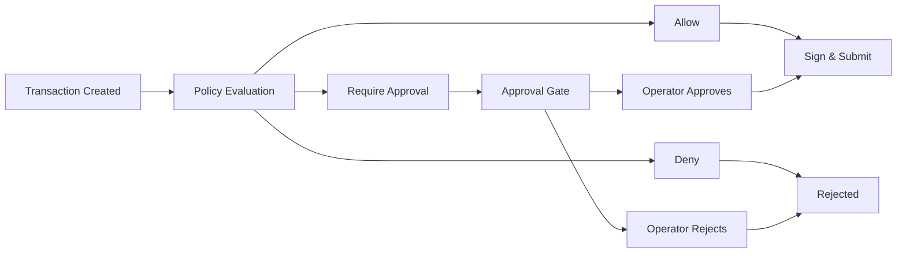

## Overview

Policies are rule-based security controls that evaluate every transaction before execution. They can **allow**, **deny**, or **require manual approval** for transactions based on configurable criteria.

## Policy Evaluation Flow

Every spend-capable transaction passes through policy evaluation:



## Creating Policies

<Tabs>
  <Tab title="CLI">
    ```bash
    npm run cli -- policy create \
      --wallet-id <walletId> \
      --name "Trading Limits" \
      --rules '[
        {
          "type": "spending_limit",
          "maxLamportsPerTx": 5000000,
          "maxLamportsPerDay": 50000000,
          "requireApprovalAboveLamports": 10000000
        },
        {
          "type": "protocol_allowlist",
          "protocols": ["system-program", "jupiter", "marinade"]
        }
      ]' \
      --active true
    ```
  </Tab>

  <Tab title="API">
    ```bash
    curl -X POST http://localhost:3000/api/v1/policies \
      -H "Content-Type: application/json" \
      -H "x-api-key: dev-api-key" \
      -d '{
        "walletId": "<walletId>",
        "name": "Trading Limits",
        "active": true,
        "rules": [
          {
            "type": "spending_limit",
            "maxLamportsPerTx": 5000000,
            "maxLamportsPerDay": 50000000,
            "requireApprovalAboveLamports": 10000000
          },
          {
            "type": "protocol_allowlist",
            "protocols": ["system-program", "jupiter", "marinade"]
          }
        ]
      }'
    ```
  </Tab>

  <Tab title="SDK">
    ```typescript
    const policy = await client.policy.create({
      walletId: walletId,
      name: 'Trading Limits',
      active: true,
      rules: [
        {
          type: 'spending_limit',
          maxLamportsPerTx: 5_000_000,
          maxLamportsPerDay: 50_000_000,
          requireApprovalAboveLamports: 10_000_000
        },
        {
          type: 'protocol_allowlist',
          protocols: ['system-program', 'jupiter', 'marinade']
        }
      ]
    });

    console.log(`Policy created: ${policy.id}`);
    ```
  </Tab>
</Tabs>

## Policy Rule Types

### Spending Limit

Control transaction amounts and require approval above thresholds:

```json
{
  "type": "spending_limit",
  "maxLamportsPerTx": 1000000,
  "maxLamportsPerDay": 10000000,
  "requireApprovalAboveLamports": 500000
}
```

| Field | Description |
|-------|-------------|
| `maxLamportsPerTx` | Maximum lamports per transaction (deny above) |
| `maxLamportsPerDay` | Maximum lamports per 24-hour period (deny above) |
| `requireApprovalAboveLamports` | Trigger approval gate for amounts above this |

<Note>
  All fields are optional. Omit a field to skip that check.
</Note>

### Protocol Allowlist

Restrict which protocols can be used:

```json
{
  "type": "protocol_allowlist",
  "protocols": ["system-program", "jupiter", "spl-token"]
}
```

Denies any transaction using protocols not in the list.

### Address Allowlist

Only allow transactions to specific addresses:

```json
{
  "type": "address_allowlist",
  "addresses": [
    "8xKzZ...",
    "9yNmP..."
  ]
}
```

### Address Blocklist

Block transactions to specific addresses:

```json
{
  "type": "address_blocklist",
  "addresses": [
    "BadAddr1...",
    "BadAddr2..."
  ]
}
```

### Program Allowlist

Restrict which Solana programs can be invoked:

```json
{
  "type": "program_allowlist",
  "programIds": [
    "11111111111111111111111111111111",
    "TokenkegQfeZyiNwAJbNbGKPFXCWuBvf9Ss623VQ5DA"
  ]
}
```

### Token Allowlist

Only allow specific SPL token mints:

```json
{
  "type": "token_allowlist",
  "mints": [
    "So11111111111111111111111111111111111111112",
    "EPjFWdd5AufqSSqeM2qN1xzybapC8G4wEGGkZwyTDt1v"
  ]
}
```

### Rate Limit

Limit transaction frequency:

```json
{
  "type": "rate_limit",
  "maxTx": 10,
  "windowSeconds": 3600
}
```

Allows maximum of 10 transactions per hour.

### Time Window

Only allow transactions during specific hours:

```json
{
  "type": "time_window",
  "startHourUtc": 9,
  "endHourUtc": 17
}
```

Allows transactions only between 9 AM and 5 PM UTC.

### Max Slippage

Limit slippage tolerance for swaps:

```json
{
  "type": "max_slippage",
  "maxBps": 100
}
```

Denies swaps with slippage above 1% (100 basis points).

### Protocol Risk

Advanced controls for specific protocols:

```json
{
  "type": "protocol_risk",
  "protocol": "jupiter",
  "maxSlippageBps": 50,
  "maxPoolConcentrationBps": 5000,
  "allowedPools": ["pool1...", "pool2..."],
  "allowedPrograms": ["prog1...", "prog2..."],
  "oracleDeviationBps": 200
}
```

### Portfolio Risk

Portfolio-level risk controls:

```json
{
  "type": "portfolio_risk",
  "maxDrawdownLamports": 100000000,
  "maxDailyLossLamports": 50000000,
  "maxExposureBpsPerToken": 2000,
  "maxExposureBpsPerProtocol": 3000
}
```

| Field | Description |
|-------|-------------|
| `maxDrawdownLamports` | Maximum portfolio drawdown allowed |
| `maxDailyLossLamports` | Maximum daily loss allowed |
| `maxExposureBpsPerToken` | Max 20% exposure per token (2000 bps) |
| `maxExposureBpsPerProtocol` | Max 30% exposure per protocol (3000 bps) |

## Policy Evaluation

Test how a transaction would be evaluated without executing it:

<CodeGroup>
  ```bash CLI
  npm run cli -- policy evaluate \
    --wallet-id <walletId> \
    --type transfer_sol \
    --protocol system-program \
    --destination <pubkey> \
    --amount-lamports 1000000
  ```

  ```bash API
  curl -X POST http://localhost:3000/api/v1/evaluate \
    -H "Content-Type: application/json" \
    -H "x-api-key: dev-api-key" \
    -d '{
      "walletId": "<walletId>",
      "type": "transfer_sol",
      "protocol": "system-program",
      "destination": "<pubkey>",
      "amountLamports": 1000000
    }'
  ```

  ```typescript SDK
  const decision = await client.policy.evaluate({
    walletId: walletId,
    type: 'transfer_sol',
    protocol: 'system-program',
    destination: destinationPubkey,
    amountLamports: 1_000_000
  });

  console.log(`Decision: ${decision.decision}`);
  console.log(`Reasons: ${decision.reasons.join(', ')}`);
  console.log(`Risk Tier: ${decision.riskTier}`);
  ```
</CodeGroup>

**Response:**
```json
{
  "decision": "allow",
  "reasons": [
    "Spending limit check passed",
    "Protocol allowlist check passed"
  ],
  "riskTier": "low"
}
```

Possible decisions:
- `allow` - Transaction proceeds automatically
- `deny` - Transaction blocked
- `require_approval` - Transaction pauses at approval gate

## Approval Gate Workflow

When a policy requires approval:

<Steps>
  <Step title="Transaction Pauses">
    Transaction status becomes `approval_gate` and waits for operator action.
  </Step>

  <Step title="List Pending Approvals">
    ```bash
    npm run cli -- tx pending --wallet-id <walletId>
    ```

    Or via API:
    ```bash
    curl -H "x-api-key: dev-api-key" \
      http://localhost:3000/api/v1/wallets/<walletId>/pending-approvals
    ```
  </Step>

  <Step title="Review Transaction Details">
    ```bash
    npm run cli -- tx get <txId>
    ```

    Check the intent, amount, destination, and policy reasons.
  </Step>

  <Step title="Approve or Reject">
    <CodeGroup>
      ```bash Approve
      npm run cli -- tx approve <txId>
      ```

      ```bash Reject
      npm run cli -- tx reject <txId>
      ```
    </CodeGroup>
  </Step>

  <Step title="Transaction Continues">
    After approval, transaction proceeds to signing and submission.
  </Step>
</Steps>

## Policy Versioning

Policies support versioning for safe updates:

### List Policy Versions

```bash
npm run cli -- policy versions <policyId>
```

### Get Specific Version

```bash
npm run cli -- policy version <policyId> --number 2
```

### Migrate Policy

```bash
npm run cli -- policy migrate <policyId> --target-version 3 --mode safe
```

Migration modes:
- `safe` - Only migrate if compatible
- `force` - Migrate regardless of compatibility warnings

### Check Compatibility

Validate rules before creating or updating:

```bash
npm run cli -- policy compatibility-check \
  --rules '[{"type":"spending_limit","maxLamportsPerTx":1000000}]'
```

## Managing Policies

### List Wallet Policies

<CodeGroup>
  ```bash CLI
  npm run cli -- policy list --wallet-id <walletId>
  ```

  ```bash API
  curl -H "x-api-key: dev-api-key" \
    http://localhost:3000/api/v1/wallets/<walletId>/policies
  ```

  ```typescript SDK
  const policies = await client.policy.list(walletId);
  ```
</CodeGroup>

### Update Policy

```typescript
const updated = await client.policy.update(policyId, {
  active: false, // Disable policy
  rules: [ /* updated rules */ ]
});
```

<Warning>
  Updating a policy creates a new version. Old transactions may reference previous versions.
</Warning>

## Real-World Examples

### Conservative Trading Bot

```json
{
  "name": "Conservative Trader",
  "rules": [
    {
      "type": "spending_limit",
      "maxLamportsPerTx": 10000000,
      "maxLamportsPerDay": 100000000
    },
    {
      "type": "protocol_allowlist",
      "protocols": ["jupiter"]
    },
    {
      "type": "max_slippage",
      "maxBps": 50
    },
    {
      "type": "rate_limit",
      "maxTx": 20,
      "windowSeconds": 3600
    }
  ]
}
```

### High-Security Treasury

```json
{
  "name": "Treasury Security",
  "rules": [
    {
      "type": "spending_limit",
      "requireApprovalAboveLamports": 5000000
    },
    {
      "type": "address_allowlist",
      "addresses": ["TrustedAddr1...", "TrustedAddr2..."]
    },
    {
      "type": "time_window",
      "startHourUtc": 9,
      "endHourUtc": 17
    },
    {
      "type": "rate_limit",
      "maxTx": 5,
      "windowSeconds": 86400
    }
  ]
}
```

### DeFi Yield Farmer

```json
{
  "name": "Yield Strategy",
  "rules": [
    {
      "type": "protocol_allowlist",
      "protocols": ["marinade", "solend", "jupiter"]
    },
    {
      "type": "max_slippage",
      "maxBps": 100
    },
    {
      "type": "portfolio_risk",
      "maxExposureBpsPerProtocol": 3000,
      "maxDailyLossLamports": 50000000
    }
  ]
}
```

## Policy Best Practices

<Note>
  **Security Recommendations:**
  - Always set `maxLamportsPerTx` and `maxLamportsPerDay` for production wallets
  - Use `requireApprovalAboveLamports` for high-value thresholds
  - Combine multiple rule types for defense-in-depth
  - Test policies with `policy evaluate` before activating
  - Enable `time_window` rules for business hours-only operation
  - Use `rate_limit` to prevent runaway execution
</Note>

## Next Steps

<CardGroup cols={2}>
  <Card title="Managing Agents" icon="robot" href="/guides/managing-agents">
    Create autonomous agents with policy-gated capabilities
  </Card>
  <Card title="Protocol Interactions" icon="plug" href="/guides/protocol-interactions">
    Execute DeFi operations with policy protection
  </Card>
</CardGroup>
