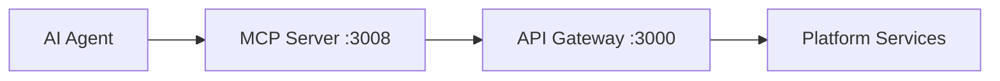

## Overview

The MCP (Model Context Protocol) server provides a standardized interface for AI agents to interact with the Agentic Wallet platform. It exposes curated tools and a generic gateway proxy for schema-validated API access.

**Port**: `3008` (default)

## Architecture

The MCP server acts as a tool invocation layer between AI agents and the API Gateway.



## Endpoints

### List Tools

Get all available MCP tools with descriptions.

```http
GET /mcp/tools
```

**Response**:
```json
{
  "data": [
    {
      "name": "wallet.create",
      "description": "Create a wallet"
    },
    {
      "name": "wallet.balance",
      "description": "Get wallet SOL balance"
    },
    {
      "name": "tx.create",
      "description": "Create a transaction from intent"
    },
    {
      "name": "gateway.request",
      "description": "Call any API gateway /api/v1 endpoint with schema validation"
    }
  ]
}
```

### Call Tool

Invoke a specific MCP tool with arguments.

```http
POST /mcp/call
Content-Type: application/json

{
  "tool": "wallet.balance",
  "args": {
    "walletId": "wallet-uuid"
  }
}
```

**Response**:
```json
{
  "data": {
    "walletId": "wallet-uuid",
    "publicKey": "base58-pubkey",
    "lamports": 1000000000,
    "sol": 1.0
  }
}
```

## Available Tools

The MCP server provides **70+ curated tools** across all platform capabilities.

### Wallet Tools

<Accordion title="Wallet Operations (7 tools)">
| Tool | Description | Required Args |
|------|-------------|---------------|
| `wallet.create` | Create a wallet | `label?` |
| `wallet.list` | List wallets | `publicKey?` |
| `wallet.get` | Get wallet metadata | `walletId` |
| `wallet.balance` | Get wallet SOL balance | `walletId` |
| `wallet.tokens` | Get wallet SPL balances | `walletId` |
| `wallet.sign_message` | Sign a base64 message | `walletId`, `message` |
| `wallet.sign_transaction` | Sign a base64 transaction | `walletId`, `transaction` |

**Example**:
```json
{
  "tool": "wallet.create",
  "args": {
    "label": "trading-bot"
  }
}
```
</Accordion>

### Transaction Tools

<Accordion title="Transaction Operations (10 tools)">
| Tool | Description | Required Args |
|------|-------------|---------------|
| `tx.create` | Create a transaction from intent | `walletId`, `type`, `protocol`, `intent` |
| `tx.get` | Fetch transaction by id | `txId` |
| `tx.retry` | Retry a transaction | `txId` |
| `tx.approve` | Approve approval-gated transaction | `txId` |
| `tx.reject` | Reject approval-gated transaction | `txId` |
| `tx.proof` | Get execution proof | `txId` |
| `tx.replay` | Get deterministic replay data | `txId` |
| `tx.list_by_wallet` | List wallet transactions | `walletId` |
| `tx.pending_approvals` | List pending approvals | `walletId` |
| `tx.positions` | List protocol positions | `walletId` |
| `tx.escrows` | List escrow records | `walletId` |

**Example**:
```json
{
  "tool": "tx.create",
  "args": {
    "walletId": "wallet-uuid",
    "type": "transfer_sol",
    "protocol": "system-program",
    "intent": {
      "destination": "recipient-pubkey",
      "lamports": 1000000
    }
  }
}
```
</Accordion>

### Policy Tools

<Accordion title="Policy Operations (5 tools)">
| Tool | Description | Required Args |
|------|-------------|---------------|
| `policy.create` | Create a policy | `walletId`, `name`, `rules`, `active` |
| `policy.list_wallet` | List policies for wallet | `walletId` |
| `policy.compatibility_check` | Check rule compatibility | `rules` |
| `policy.migrate` | Migrate policy version | `policyId`, `targetVersion` |
| `policy.evaluate` | Evaluate policy decision | `walletId`, `type`, `protocol` |

**Example**:
```json
{
  "tool": "policy.evaluate",
  "args": {
    "walletId": "wallet-uuid",
    "type": "transfer_sol",
    "protocol": "system-program",
    "amountLamports": 500000
  }
}
```
</Accordion>

### Agent Tools

<Accordion title="Agent Operations (11 tools)">
| Tool | Description | Required Args |
|------|-------------|---------------|
| `agent.create` | Create an agent | `name`, `executionMode`, `allowedIntents` |
| `agent.list` | List agents | - |
| `agent.get` | Get agent details | `agentId` |
| `agent.capabilities_update` | Update agent capabilities | `agentId`, `allowedIntents` |
| `agent.start` | Start agent scheduler | `agentId` |
| `agent.stop` | Stop agent scheduler | `agentId` |
| `agent.pause` | Pause an agent | `agentId`, `reason?` |
| `agent.resume` | Resume an agent | `agentId` |
| `agent.budget` | Get agent budget status | `agentId` |
| `agent.manifest_issue` | Issue capability manifest | `agentId`, `allowedIntents`, `allowedProtocols` |
| `agent.manifest_verify` | Verify capability manifest | `agentId`, `manifest` |
| `agent.execute` | Execute intent as agent | `agentId`, `type`, `protocol`, `intent` |

**Example**:
```json
{
  "tool": "agent.execute",
  "args": {
    "agentId": "agent-uuid",
    "type": "swap",
    "protocol": "jupiter",
    "intent": {
      "inputMint": "SOL_MINT",
      "outputMint": "USDC_MINT",
      "amount": "1000000",
      "slippageBps": 50
    }
  }
}
```
</Accordion>

### Protocol Tools

<Accordion title="Protocol Operations (15 tools)">
| Tool | Description | Required Args |
|------|-------------|---------------|
| `protocol.list` | List available protocols | - |
| `protocol.capabilities` | Get protocol capabilities | `protocol` |
| `protocol.health_all` | Get health for all protocols | - |
| `protocol.health` | Get health for a protocol | `protocol` |
| `protocol.quote` | Fetch swap quote | `protocol`, `inputMint`, `outputMint`, `amount`, `walletAddress` |
| `protocol.swap` | Build swap transaction | Same as quote |
| `protocol.stake` | Build staking transaction | `protocol`, `walletAddress`, `amount` |
| `protocol.unstake` | Build unstake transaction | Same as stake |
| `protocol.lend_supply` | Build lending supply | `protocol`, `walletAddress`, `mint`, `amount` |
| `protocol.lend_borrow` | Build lending borrow | Same as supply |
| `protocol.escrow_create` | Build create escrow | `walletAddress`, `intent` |
| `protocol.escrow_accept` | Build accept escrow | `escrowId`, `walletAddress` |
| `protocol.escrow_release` | Build release escrow | Same as accept |
| `protocol.escrow_refund` | Build refund escrow | Same as accept |
| `protocol.escrow_dispute` | Build dispute escrow | Same as accept |
| `protocol.escrow_resolve` | Build resolve escrow | Same as accept |

**Example**:
```json
{
  "tool": "protocol.quote",
  "args": {
    "protocol": "jupiter",
    "inputMint": "So11111111111111111111111111111111111111112",
    "outputMint": "EPjFWdd5AufqSSqeM2qN1xzybapC8G4wEGGkZwyTDt1v",
    "amount": "1000000",
    "walletAddress": "wallet-pubkey",
    "slippageBps": 50
  }
}
```
</Accordion>

### Risk Tools

<Accordion title="Risk & Chaos Operations (8 tools)">
| Tool | Description | Required Args |
|------|-------------|---------------|
| `risk.list_protocols` | List protocol risk configs | - |
| `risk.get_protocol` | Get protocol risk config | `protocol` |
| `risk.set_protocol` | Update protocol risk config | `protocol`, config fields |
| `risk.list_portfolio` | List portfolio risk controls | - |
| `risk.get_portfolio` | Get wallet portfolio controls | `walletId` |
| `risk.set_portfolio` | Update portfolio controls | `walletId`, control fields |
| `risk.get_chaos` | Get chaos switchboard settings | - |
| `risk.set_chaos` | Update chaos settings | `enabled?`, `failureRates?`, `latencyMs?` |

**Example**:
```json
{
  "tool": "risk.set_protocol",
  "args": {
    "protocol": "jupiter",
    "maxSlippageBps": 100,
    "requireOracleForSwap": true
  }
}
```
</Accordion>

### Strategy & Treasury Tools

<Accordion title="Strategy & Treasury Operations (5 tools)">
| Tool | Description | Required Args |
|------|-------------|---------------|
| `strategy.backtest` | Run strategy backtest | `walletId`, `name`, `steps` |
| `strategy.paper_execute` | Execute paper trade | `agentId`, `walletId`, `type`, `protocol`, `intent` |
| `strategy.paper_list` | List paper trades | `agentId` |
| `treasury.allocate` | Allocate treasury budget | `targetAgentId`, `lamports` |
| `treasury.rebalance` | Rebalance treasury | `sourceAgentId`, `targetAgentId`, `lamports` |

**Example**:
```json
{
  "tool": "treasury.allocate",
  "args": {
    "targetAgentId": "agent-uuid",
    "lamports": 10000000,
    "reason": "Initial allocation"
  }
}
```
</Accordion>

### Audit Tools

<Accordion title="Audit & Metrics (2 tools)">
| Tool | Description | Required Args |
|------|-------------|---------------|
| `audit.events` | List audit events | filters (all optional) |
| `audit.metrics` | Get metrics snapshot | - |

**Example**:
```json
{
  "tool": "audit.events",
  "args": {
    "agentId": "agent-uuid",
    "protocol": "jupiter"
  }
}
```
</Accordion>

## Gateway Request Tool

The `gateway.request` tool provides schema-validated access to **any** `/api/v1` endpoint.

### Usage

```json Request Format
{
  "tool": "gateway.request",
  "args": {
    "path": "/api/v1/...",
    "method": "GET" | "POST" | "PUT" | "PATCH" | "DELETE",
    "query": { ... },  // optional, for GET/DELETE
    "body": { ... }    // optional, for POST/PUT/PATCH
  }
}
```

### Schema Validation

The tool validates:
- `path` must match `/^/api/v1/[a-zA-Z0-9/_:-]*$/`
- `method` must be valid HTTP method
- `query` must be record of string/number/boolean
- `body` must be valid JSON object

### Examples

<CodeGroup>
```json GET Request
{
  "tool": "gateway.request",
  "args": {
    "path": "/api/v1/wallets/wallet-uuid/balance",
    "method": "GET"
  }
}
```

```json POST Request
{
  "tool": "gateway.request",
  "args": {
    "path": "/api/v1/transactions",
    "method": "POST",
    "body": {
      "walletId": "wallet-uuid",
      "type": "transfer_sol",
      "protocol": "system-program",
      "intent": {
        "destination": "recipient-pubkey",
        "lamports": 1000000
      }
    }
  }
}
```

```json PUT with Query
{
  "tool": "gateway.request",
  "args": {
    "path": "/api/v1/risk/protocols/jupiter",
    "method": "PUT",
    "body": {
      "maxSlippageBps": 100
    }
  }
}
```

```json GET with Query Params
{
  "tool": "gateway.request",
  "args": {
    "path": "/api/v1/audit/events",
    "method": "GET",
    "query": {
      "agentId": "agent-uuid",
      "protocol": "jupiter"
    }
  }
}
```
</CodeGroup>

## Error Handling

MCP tools return normalized error responses.

### Input Validation Errors

```json Invalid Tool
{
  "error": "Unknown MCP tool: invalid.tool"
}
// HTTP 404
```

```json Missing Required Argument
{
  "error": "walletId is required"
}
// HTTP 400
```

```json Invalid Schema
{
  "error": "Expected object, received string"
}
// HTTP 400
```

### Gateway Errors

When the underlying gateway request fails:

```json Gateway Error
{
  "error": "Policy violation: spending limit exceeded code=POLICY_VIOLATION stage=policy traceId=abc-123"
}
// HTTP 500
```

## Authentication

The MCP server uses environment-configured credentials to authenticate with the API Gateway.

```bash Environment Configuration
API_BASE_URL=http://localhost:3000
API_KEY=dev-api-key
TENANT_ID=my-tenant  # optional
```

**Headers sent to gateway**:
- `x-api-key`: From `API_KEY` env var
- `x-tenant-id`: From `TENANT_ID` env var (if set)
- `content-type`: `application/json`

## Health Check

```http
GET /health
```

**Response**:
```json
{
  "status": "ok",
  "service": "mcp-server"
}
```

## Using the SDK

The TypeScript SDK includes an MCP client for tool invocation.

```typescript SDK MCP Client
import { createAgenticWalletClient } from '@agentic-wallet/sdk';

const client = createAgenticWalletClient('http://localhost:3000', {
  apiKey: 'dev-api-key',
});

// List tools
const tools = await client.mcp.tools();

// Call tool
const balance = await client.mcp.call('wallet.balance', {
  walletId: 'wallet-uuid',
});
```

## Integration Patterns

### AI Agent Tool Use

```typescript Agent Integration
// In your AI agent code:
const availableTools = await client.mcp.tools();

// Present tools to LLM
const toolSchemas = availableTools.map(tool => ({
  name: tool.name,
  description: tool.description,
}));

// When LLM requests tool use:
const result = await client.mcp.call(
  llmToolCall.name,
  llmToolCall.arguments
);

// Return result to LLM
```

### Orchestrator Pattern

```typescript Workflow Orchestration
// Create wallet
const wallet = await client.mcp.call('wallet.create', {
  label: 'orchestrator-wallet',
});

// Create agent
const agent = await client.mcp.call('agent.create', {
  name: 'trading-agent',
  walletId: wallet.walletId,
  executionMode: 'autonomous',
  allowedIntents: ['swap', 'query_balance'],
});

// Execute workflow
const quote = await client.mcp.call('protocol.quote', {
  protocol: 'jupiter',
  inputMint: 'SOL_MINT',
  outputMint: 'USDC_MINT',
  amount: '1000000',
  walletAddress: wallet.publicKey,
});

const tx = await client.mcp.call('agent.execute', {
  agentId: agent.agentId,
  type: 'swap',
  protocol: 'jupiter',
  intent: quote.intent,
});
```

## Tool Discovery

Agents can dynamically discover available tools at runtime.

```typescript Dynamic Tool Discovery
const allTools = await client.mcp.tools();

// Filter by prefix
const walletTools = allTools.filter(t => t.name.startsWith('wallet.'));
const agentTools = allTools.filter(t => t.name.startsWith('agent.'));
const protocolTools = allTools.filter(t => t.name.startsWith('protocol.'));

// Build tool index
const toolIndex = new Map(
  allTools.map(t => [t.name, t.description])
);
```

## Best Practices

<AccordionGroup>
  <Accordion title="Use typed tools over gateway.request">
    Prefer named tools like `wallet.create` instead of `gateway.request` for better type safety and validation.
  </Accordion>
  
  <Accordion title="Handle errors gracefully">
    Always wrap MCP calls in try-catch and parse error messages for structured error codes and stages.
  </Accordion>
  
  <Accordion title="Cache tool list">
    Call `mcp.tools()` once at startup and cache the result rather than fetching on every operation.
  </Accordion>
  
  <Accordion title="Validate arguments">
    Validate tool arguments client-side before calling to reduce round-trips and error noise.
  </Accordion>
</AccordionGroup>

## Next Steps

<CardGroup cols={2}>
  <Card title="CLI Integration" icon="terminal" href="/integration/cli">
    Use the command-line interface
  </Card>
  <Card title="SDK Integration" icon="code" href="/integration/sdk">
    Integrate with TypeScript SDK
  </Card>
  <Card title="SKILLS Contract" icon="file-contract" href="/integration/skills">
    Review agent integration contract
  </Card>
  <Card title="API Reference" icon="book" href="/api/overview">
    Explore REST API endpoints
  </Card>
</CardGroup>