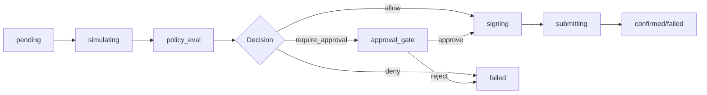

## Overview

The `SKILLS.md` file is the **canonical integration contract** for AI agents and orchestrators working with the Agentic Wallet platform. It provides a machine-readable specification of capabilities, runtime behavior, schemas, and operational constraints.

**Location**: `/SKILLS.md` in the repository root

**Last Verified**: 2026-03-03

## Purpose

SKILLS.md serves as the **single source of truth** for:

1. **Integration modes** - How agents can interact with the platform (CLI, SDK, API, MCP)
2. **Intent schemas** - Canonical request/response formats
3. **Execution semantics** - Transaction lifecycle and async behavior
4. **Output contracts** - What agents must return after substantial operations
5. **Runtime constraints** - Known limitations and operational boundaries

## Skills Index Version

```yaml Current State
skills_index_version: 3
project: agentic-wallet
network_default: solana-devnet
repo_skill_dir: skills/
repo_skill_files_present: false
```

<Note>
The `skills/` directory exists but contains no checked-in `SKILL.md` files. `SKILLS.md` in the root is the active integration contract.
</Note>

## Integration Modes

Agents can integrate using four primary modes:

<Tabs>
  <Tab title="Intent Runner (Legacy)">
    Compatibility CLI for orchestrators that use legacy intent formats.
    
    ```bash Intent Runner
    npm run intent-runner -- --file <intent.json>
    npm run intent-runner -- --intent '<json-string>'
    ```
    
    **Legacy Adapter Behavior**:
    - `fromWalletId` (base58) → internal `walletId` UUID lookup
    - Legacy `chain`/`createdAt`/`reasoning` preserved at `intent.legacy`
    - Intent type normalization:
      - `transfer` → `transfer_sol` or `transfer_spl`
      - `swap` → `swap`
      - `create_mint` → `create_mint`
      - `mint_token` → `mint_token`
  </Tab>
  
  <Tab title="Operator CLI">
    Full-featured command-line interface with all platform operations.
    
    ```bash CLI Commands
    npm run cli -- doctor
    npm run cli -- wallet create [label]
    npm run cli -- agent exec <agentId> --type <type> --protocol <protocol> --intent '<json>'
    npm run cli -- tx create --wallet-id <id> --type <type> --protocol <protocol> --intent '<json>'
    ```
    
    See [CLI Integration](/integration/cli) for complete command reference.
  </Tab>
  
  <Tab title="TypeScript SDK">
    Typed SDK client for programmatic integration.
    
    ```typescript SDK Usage
    import { createAgenticWalletClient } from '@agentic-wallet/sdk';
    
    const client = createAgenticWalletClient(baseUrl, { 
      apiKey, 
      tenantId 
    });
    
    // Exposed modules:
    client.wallet
    client.policy
    client.transaction
    client.agent
    client.protocol
    client.risk
    client.strategy
    client.treasury
    client.audit
    client.mcp
    ```
    
    See [SDK Integration](/integration/sdk) for complete module reference.
  </Tab>
  
  <Tab title="MCP Tools">
    Model Context Protocol server for AI agent tool invocation.
    
    **Endpoints**:
    - `GET /mcp/tools` - List available tools
    - `POST /mcp/call` - Invoke a tool
    
    **Current Tools** (70+ available):
    - `wallet.create`, `wallet.balance`, `wallet.tokens`
    - `tx.create`, `tx.get`, `tx.approve`
    - `policy.evaluate`, `policy.create`
    - `protocol.quote`, `protocol.swap`
    - `agent.execute`, `agent.create`
    - `risk.get_protocol`, `risk.set_protocol`
    - `gateway.request` (schema-validated generic proxy)
    
    See [MCP Integration](/integration/mcp) for complete tool catalog.
  </Tab>
</Tabs>

## Authentication & Scopes

### Gateway Configuration

```bash Environment Variables
API_GATEWAY_ENFORCE_AUTH=true|false  # default: true
API_GATEWAY_API_KEYS=key:tenant:scope1,scope2;key2:*:all
API_GATEWAY_RATE_LIMIT_PER_MINUTE=<int>
```

### Required Headers

```http
x-api-key: <key>
x-tenant-id: <tenant>  # optional
```

### Scope Groups

API keys can be scoped to specific capability groups:

1. `wallets` - Wallet operations
2. `transactions` - Transaction lifecycle
3. `policies` - Policy management
4. `agents` - Agent runtime
5. `protocols` - Protocol adapters
6. `risk` - Risk controls
7. `strategy` - Strategy/backtesting
8. `treasury` - Treasury operations
9. `audit` - Audit/observability
10. `mcp` - MCP tools

**Example**:
```bash
API_GATEWAY_API_KEYS=dev-api-key:*:all;restricted-key:tenant-a:wallets,transactions
```

## Canonical Intent Schemas

### Transaction Create

```json Request Schema
{
  "walletId": "uuid",
  "agentId": "uuid",         // optional
  "type": "transactionType",
  "protocol": "string",
  "gasless": false,           // optional
  "idempotencyKey": "string", // optional
  "intent": {}                // type-specific payload
}
```

### Supported Transaction Types

<Accordion title="View All Transaction Types (26 types)">
1. `transfer_sol` - Native SOL transfer
2. `transfer_spl` - SPL token transfer
3. `swap` - DEX swap
4. `stake` - Validator staking
5. `unstake` - Validator unstaking
6. `lend_supply` - Lending protocol supply
7. `lend_borrow` - Lending protocol borrow
8. `create_mint` - Create SPL token mint
9. `mint_token` - Mint SPL tokens
10. `query_balance` - Query balance (read-only)
11. `query_positions` - Query positions (read-only)
12. `create_escrow` - Create escrow contract
13. `accept_escrow` - Accept escrow
14. `release_escrow` - Release escrow funds
15. `refund_escrow` - Refund escrow
16. `dispute_escrow` - Dispute escrow
17. `resolve_dispute` - Resolve escrow dispute
18. `create_milestone_escrow` - Create milestone escrow
19. `release_milestone` - Release milestone payment
20. `x402_pay` - HTTP 402 payment
21. `flash_loan_bundle` - Flash loan bundle
22. `cpi_call` - Cross-program invocation
23. `custom_instruction_bundle` - Custom instruction bundle
24. `treasury_allocate` - Treasury allocation
25. `treasury_rebalance` - Treasury rebalance
26. `paper_trade` - Paper trade (no real funds)
</Accordion>

### Common Intent Payloads

<CodeGroup>
```json transfer_sol
{
  "type": "transfer_sol",
  "protocol": "system-program",
  "intent": {
    "destination": "base58-pubkey",
    "lamports": 1000000
  }
}
```

```json transfer_spl
{
  "type": "transfer_spl",
  "protocol": "spl-token",
  "intent": {
    "destination": "base58-pubkey",
    "mint": "token-mint-pubkey",
    "amount": "1000000"
  }
}
```

```json swap
{
  "type": "swap",
  "protocol": "jupiter",
  "intent": {
    "inputMint": "SOL_MINT",
    "outputMint": "USDC_MINT",
    "amount": "1000000",
    "slippageBps": 50
  }
}
```

```json query_balance
{
  "type": "query_balance",
  "protocol": "system-program",
  "intent": {}
}
```
</CodeGroup>

<Note>
**Read-only intents** (`query_balance`, `query_positions`) do not produce on-chain signatures and confirm without submission.

**Rent precheck**: `transfer_sol` validates unfunded destination rent threshold before execution.
</Note>

## Policy Rule Types

Policies support 11 rule types for governance:

<Accordion title="Policy Rule Reference">
1. **`spending_limit`** - Per-transaction and daily spending caps
   ```json
   {
     "type": "spending_limit",
     "maxLamportsPerTx": 1000000,
     "maxLamportsPerDay": 10000000,
     "requireApprovalAboveLamports": 500000
   }
   ```

2. **`address_allowlist`** - Allowed destination addresses
3. **`address_blocklist`** - Blocked destination addresses
4. **`program_allowlist`** - Allowed program IDs
5. **`token_allowlist`** - Allowed token mints
6. **`protocol_allowlist`** - Allowed protocol adapters
   ```json
   {
     "type": "protocol_allowlist",
     "protocols": ["system-program", "jupiter"]
   }
   ```

7. **`rate_limit`** - Transaction rate limiting
8. **`time_window`** - Time-based restrictions
9. **`max_slippage`** - Maximum slippage tolerance
10. **`protocol_risk`** - Protocol risk controls
11. **`portfolio_risk`** - Portfolio exposure limits
</Accordion>

## Transaction Lifecycle

Canonical execution pipeline:



**Behavior Rules**:

1. `POST /api/v1/transactions` returns `201`, `202`, or `500` based on current state
2. Use `GET /api/v1/transactions/:txId` polling for final state
3. If `approval_gate`, call `/approve` or `/reject`
4. `idempotencyKey` replays prior record when identical key is reused
5. Durable outbox is SQLite-backed for create/retry/approve processing

## Response Envelope

Gateway normalizes all responses to a stable machine envelope:

```json Response Format
{
  "status": "success" | "failure",
  "errorCode": "VALIDATION_ERROR" | "POLICY_VIOLATION" | "PIPELINE_ERROR" | "CONFIRMATION_FAILED" | null,
  "failedAt": "validation" | "policy" | "build" | "sign" | "send" | "confirm" | "completed" | "gateway" | null,
  "stage": "validation" | "policy" | "build" | "sign" | "send" | "confirm" | "completed" | "gateway",
  "traceId": "uuid",
  "data": {},
  "error": "optional string",
  "errorMessage": "optional string"
}
```

<Warning>
**Critical Behavior**: `GET /api/v1/transactions/:txId` may return HTTP `200` but envelope `status="failure"` when `data.status="failed"`.

Agents **must** key control flow from envelope `status`, `errorCode`, and `stage`, not HTTP code alone.
</Warning>

### Error Codes

- `VALIDATION_ERROR` - Schema/input mismatch
- `POLICY_VIOLATION` - Policy/capability/budget disallow
- `PIPELINE_ERROR` - Build/sign/send/runtime failures
- `CONFIRMATION_FAILED` - Explicit confirmation-stage failures

## Agent Heartbeat Context

When agents run in autonomous mode, the scheduler provides context on each tick:

```json Scheduler Context Fields
{
  "tick": 1,
  "walletId": "uuid",
  "knownWallets": [...],
  "meta": {...},
  "balance": {...},
  "tokens": [...],
  "recentTransactions": [...],
  "openApprovals": [...],
  "protocolPositions": [...],
  "escrowSummary": {...},
  "policySummary": {...}
}
```

Agents can use this context to make autonomous decisions based on current state.

## Output Contract for Agents

For substantial runs, agents should return:

1. **Interface used** - CLI/API/SDK/MCP
2. **Commands or API calls executed** - Full command/request log
3. **Wallet/agent/transaction IDs and signatures** - All created resources
4. **Final statuses and policy decisions** - Terminal states
5. **Proof/replay references** - Auditability artifacts
6. **Remaining risks or TODOs** - Operational notes

**Example Output**:

```markdown Agent Run Summary
## Interface
SDK (TypeScript)

## Commands Executed
1. `client.wallet.create({ label: 'bot-1' })`
2. `client.agent.create({ name: 'arb-bot', walletId, ... })`
3. `client.agent.execute(agentId, { type: 'swap', ... })`

## IDs
- Wallet: `abc-123`
- Agent: `def-456`
- Transaction: `ghi-789`
- Signature: `base58-sig`

## Status
- Transaction: `confirmed`
- Policy: `allow`

## Proofs
- `/api/v1/transactions/ghi-789/proof`
- `/api/v1/transactions/ghi-789/replay`

## Risks
- Escrow adapter requires deployed program ID
```

## Reliability & Durability

### RPC Failover

```bash RPC Pool Configuration
SOLANA_RPC_URL=https://api.devnet.solana.com
SOLANA_RPC_POOL_URLS=https://rpc1.com,https://rpc2.com,https://rpc3.com
SOLANA_RPC_HEALTH_PROBE_MS=30000
SOLANA_RPC_MAX_RETRIES=3
SOLANA_RPC_RETRY_DELAY_MS=1000
```

**Behavior**:
- Health-scored RPC pool failover
- Background endpoint probes and runtime health scoring
- Adaptive compute budget and priority fee tuning

### Durable Outbox

```bash Outbox Configuration
TX_OUTBOX_LEASE_MS=60000
TX_OUTBOX_POLL_MS=5000
TX_OUTBOX_MAX_ATTEMPTS=5
TRANSACTION_ENGINE_DB_PATH=./data/tx-engine.db
```

**Semantics**:
- SQLite-backed queue with lease/retry/dedupe/recovery
- Restart recovery drain of pending processing work
- Deterministic idempotency via `idempotencyKey`

### Delta Guard

```bash Delta Guard Configuration
DELTA_GUARD_ABSOLUTE_TOLERANCE_LAMPORTS=5000
```

**Behavior**:
- Checks expected vs observed lamport movement
- Absolute lamport tolerance avoids false positive fee-noise pauses
- Auto-pause on delta breach respects wallet `autoPauseOnBreach` control

## Security Guardrails

<Warning>
**Critical Security Rules**:

1. Agent logic must **never** hold or print private keys
2. Signing is **only** through wallet-engine sign boundary
3. Keep execution pipeline ordering intact
4. Simulate before submit whenever supported
5. Default demos/tests to Solana devnet
6. Do not bypass durable outbox for spend-capable actions
7. Choose signer backend explicitly for production
</Warning>

### Signer Backends

```bash Signer Configuration
WALLET_SIGNER_BACKEND=encrypted-file|memory|kms|hsm|mpc

# KMS
WALLET_KMS_MASTER_SECRET=...
WALLET_KMS_KEY_ID=...  # optional

# HSM
WALLET_HSM_PIN=...
WALLET_HSM_MODULE_SECRET=...
WALLET_HSM_SLOT=...  # optional

# MPC
WALLET_MPC_NODE_SECRETS=secret1,secret2,secret3
# or
WALLET_MPC_NODE1_SECRET=...
WALLET_MPC_NODE2_SECRET=...
WALLET_MPC_NODE3_SECRET=...
```

## Known Limitations

<AccordionGroup>
  <Accordion title="Single-node persistence">
    Persistence is SQLite-backed and single-node. Horizontal scale needs Postgres + distributed queue infrastructure.
  </Accordion>
  
  <Accordion title="Protocol adapter availability">
    Solend/DEX adapters depend on external API contracts and availability. They fail closed instead of returning synthetic fallback quotes.
  </Accordion>
  
  <Accordion title="Escrow program deployment">
    Escrow adapter requires a deployed escrow program (`ESCROW_PROGRAM_ID`) and account wiring in intent. This repo does not ship a deployed escrow program artifact.
  </Accordion>
  
  <Accordion title="MCP tool coverage">
    MCP includes a validated generic `gateway.request` tool, but named high-level MCP wrappers are curated (not exhaustive one-by-one parity wrappers).
  </Accordion>
</AccordionGroup>

## Minimal Integration Runbook

<Steps>
  <Step title="Install dependencies">
    ```bash
    npm install
    ```
  </Step>
  
  <Step title="Configure environment">
    ```bash
    cp .env.example .env
    # Edit .env with required values
    ```
    
    Minimum required:
    - `WALLET_KEY_ENCRYPTION_SECRET`
    - `API_GATEWAY_API_KEYS` (or keep default)
  </Step>
  
  <Step title="Start services">
    ```bash
    set -a; source .env; set +a
    npm run dev
    ```
  </Step>
  
  <Step title="Create wallet & agent">
    ```bash
    npm run wallets -- create --label bot-1
    npm run cli -- agent create arb-bot --intents transfer_sol query_balance
    ```
  </Step>
  
  <Step title="Attach policy">
    ```bash
    npm run cli -- policy create --wallet-id <walletId> --name limits --rules '[{"type":"spending_limit","maxLamportsPerTx":1000000}]'
    ```
  </Step>
  
  <Step title="Execute intent">
    ```bash
    npm run cli -- agent exec <agentId> --type query_balance --protocol system-program --intent '{}'
    ```
  </Step>
  
  <Step title="Poll until confirmed/failed">
    ```bash
    npm run cli -- tx get <txId>
    ```
  </Step>
  
  <Step title="Handle approval gate (if needed)">
    ```bash
    npm run cli -- tx approve <txId>
    # or
    npm run cli -- tx reject <txId>
    ```
  </Step>
  
  <Step title="Collect artifacts">
    ```bash
    npm run cli -- tx proof <txId>
    npm run cli -- tx replay <txId>
    npm run cli -- audit events --tx-id <txId>
    npm run cli -- audit metrics
    ```
  </Step>
</Steps>

### Smoke Tests

```bash Devnet Validation
npm run devnet:smoke
npm run devnet:multi-agent
npm run devnet:protocol-matrix
```

## Version History

| Version | Date | Changes |
|---------|------|----------|
| 3 | 2026-03-03 | Current version with SQLite persistence, MCP tools, escrow adapter |
| 2 | 2026-02-15 | Added agent autonomy, treasury, strategy modules |
| 1 | 2026-01-10 | Initial SKILLS.md with core wallet/policy/transaction |

## Next Steps

<CardGroup cols={2}>
  <Card title="CLI Integration" icon="terminal" href="/integration/cli">
    Explore the command-line interface
  </Card>
  <Card title="SDK Integration" icon="code" href="/integration/sdk">
    Integrate with TypeScript SDK
  </Card>
  <Card title="MCP Tools" icon="plug" href="/integration/mcp">
    Use MCP server for AI agents
  </Card>
  <Card title="API Reference" icon="book" href="/api/overview">
    Browse REST API endpoints
  </Card>
</CardGroup>