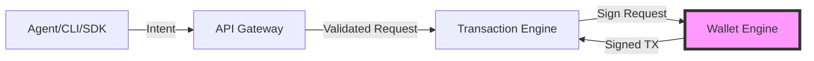

## Security Architecture

Agentic Wallet implements a defense-in-depth security model with multiple trust boundaries and protection layers. The system is designed to ensure that AI agents can execute blockchain transactions autonomously while maintaining strict security controls.

<CardGroup cols={2}>
  <Card title="Key Isolation" icon="key" href="/security/key-management">
    Private keys never leave the wallet-engine boundary
  </Card>
  <Card title="Policy Enforcement" icon="shield-check" href="/security/policy-enforcement">
    All spend-capable intents pass policy evaluation
  </Card>
  <Card title="Gateway Protection" icon="lock" href="#gateway-protections">
    API key authentication, scopes, and rate limiting
  </Card>
  <Card title="Capability Governance" icon="badge-check" href="#capability-governance">
    Agent permission controls and signed manifests
  </Card>
</CardGroup>

## Trust Boundaries

The platform enforces strict trust boundaries at multiple layers:

### Agent Boundary

Agents operate in a **zero-trust model** for key material:

- Agents **never receive** or hold private keys
- Agents emit high-level **intents** only (e.g., "transfer 0.1 SOL to address X")
- Intent validation happens server-side before any signing occurs
- Agents cannot bypass the signing boundary



### Signing Boundary

The **wallet-engine** service is the exclusive signing authority:

- Private key material is isolated within the wallet-engine process
- Only wallet-engine can access key providers (encrypted-file, KMS, HSM, MPC)
- All transaction signing requests must go through the wallet-engine API
- No direct key access from other services or agents

From `services/wallet-engine/src/app.ts:67`:

```typescript
app.post('/wallets/:walletId/sign', async (c) => {
  // Signing is exclusively controlled by wallet-engine
  const keypair = await keyProvider.load(walletId);
  const signature = transaction.sign([keypair]);
  // Keys never leave this boundary
});
```

### Policy Boundary

**All spend-capable intents** pass through policy evaluation before signing:

<Steps>
  <Step title="Intent Submission">
    Agent submits intent via API gateway
  </Step>
  <Step title="Schema Validation">
    Request validated against Zod schemas in `packages/common`
  </Step>
  <Step title="Policy Evaluation">
    Policy engine evaluates rules and returns `allow`, `deny`, or `require_approval`
  </Step>
  <Step title="Approval Gate (if needed)">
    Transaction pauses at `approval_gate` status until operator approves/rejects
  </Step>
  <Step title="Signing">
    Only after passing policy checks does wallet-engine sign the transaction
  </Step>
</Steps>

<Note>
  Read-only intents like `query_balance` and `query_positions` skip the signing stage and confirm immediately.
</Note>

### Protocol Boundary

The **protocol-adapters** service provides a safe abstraction layer:

- Agents submit protocol-agnostic intents (e.g., `swap`, `stake`, `create_escrow`)
- Protocol adapters translate intents into protocol-specific transactions
- Adapters handle complex DeFi interactions (Jupiter, Marinade, Solend, Orca, etc.)
- Unsafe operations are blocked at build time

## Gateway Protections

The API gateway (`apps/api-gateway`) provides the first line of defense:

### Authentication

API key-based authentication with configurable enforcement:

```bash
API_GATEWAY_ENFORCE_AUTH=true
API_GATEWAY_API_KEYS=key:tenant:scope1,scope2;key2:*:all
```

- Each API key can be scoped to specific tenants
- Keys can have granular permission scopes (wallets, transactions, policies, agents, etc.)
- Missing or invalid keys result in `401 Unauthorized`
- Tenant mismatches result in `403 Forbidden`

From `apps/api-gateway/src/index.ts:284`:

```typescript
if (enforceAuth) {
  const keyConfig = apiKeys.get(apiKey);
  if (!keyConfig) {
    return machineErrorResponse(c.req.raw, 401, 
      'Unauthorized: missing or invalid x-api-key', 'gateway', 'PIPELINE_ERROR');
  }
}
```

### Scope-Based Authorization

The gateway enforces granular scopes for different API surface areas:

| Scope | Coverage |
|-------|----------|
| `wallets` | Wallet creation, balance, token queries |
| `transactions` | Transaction lifecycle operations |
| `policies` | Policy creation, evaluation, versioning |
| `agents` | Agent runtime, capabilities, manifests |
| `protocols` | Protocol adapters, DeFi operations, escrow |
| `risk` | Risk controls, chaos engineering |
| `strategy` | Backtesting, paper trading |
| `treasury` | Budget allocation, rebalancing |
| `audit` | Audit events, metrics |
| `mcp` | MCP tools endpoint |
| `all` | Wildcard access to all scopes |

Scope violations return `403 Forbidden` with the missing scope name.

### Rate Limiting

Per-API-key rate limiting prevents abuse:

```bash
API_GATEWAY_RATE_LIMIT_PER_MINUTE=120
```

- Sliding window rate limiter tracks requests per API key
- Exceeding the limit returns `429 Too Many Requests`
- Rate limits reset every 60 seconds
- Separate counters maintained per API key

From `apps/api-gateway/src/index.ts:317`:

```typescript
if (state.count > rateLimitPerMinute) {
  return machineErrorResponse(c.req.raw, 429, 
    'Too Many Requests', 'gateway', 'PIPELINE_ERROR');
}
```

### Normalized Error Envelope

The gateway normalizes all responses into a machine-readable format:

```json
{
  "status": "success|failure",
  "errorCode": "VALIDATION_ERROR|POLICY_VIOLATION|PIPELINE_ERROR|CONFIRMATION_FAILED|null",
  "failedAt": "validation|policy|build|sign|send|confirm|completed|gateway|null",
  "stage": "validation|policy|build|sign|send|confirm|completed|gateway",
  "traceId": "uuid",
  "data": {},
  "error": "optional string",
  "errorMessage": "optional string"
}
```

This envelope provides:
- Consistent error reporting across all services
- Deterministic stage tracking for debugging
- Trace IDs for request correlation
- Machine-parseable error codes for automation

## Capability Governance

Agents are constrained by capability controls at multiple levels:

### Intent Allowlists

Each agent has an explicit `allowedIntents` array:

```typescript
{
  "agentId": "uuid",
  "name": "trading-bot",
  "allowedIntents": ["transfer_sol", "swap", "query_balance"],
  "executionMode": "autonomous"
}
```

- Agents can only execute intents in their allowlist
- Attempts to execute disallowed intents are rejected at runtime
- Intent permissions can be updated via `PUT /api/v1/agents/:agentId/capabilities`

### Execution Modes

Agents operate in one of two modes:

<CardGroup cols={2}>
  <Card title="Autonomous Mode" icon="robot">
    Agent can execute allowed intents without human approval (subject to policy constraints)
  </Card>
  <Card title="Supervised Mode" icon="user-check">
    All agent executions require human approval before signing
  </Card>
</CardGroup>

### Signed Capability Manifests

For high-security environments, agents can be required to present signed capability manifests:

```bash
AGENT_REQUIRE_MANIFEST=true
AGENT_MANIFEST_SIGNING_SECRET=your-secret
AGENT_MANIFEST_ISSUER=your-issuer-id
```

**Manifest issuance:**
```bash
npm run cli -- agent manifest-issue <agentId> \
  --intents transfer_sol swap \
  --protocols system-program jupiter \
  --ttl 3600
```

**Manifest verification:**
- The agent-runtime verifies manifest signatures before execution
- Manifests have time-to-live (TTL) expiration
- Intent and protocol permissions are enforced at runtime
- Invalid or expired manifests result in execution rejection

<Warning>
  Manifest enforcement is optional but recommended for production deployments with autonomous agents.
</Warning>

## Security Best Practices

<Steps>
  <Step title="Use Strong Encryption Secrets">
    Set a cryptographically random `WALLET_KEY_ENCRYPTION_SECRET` for production
  </Step>
  <Step title="Choose Production Signer Backend">
    Use `kms`, `hsm`, or `mpc` signer backends for production (not `encrypted-file` or `memory`)
  </Step>
  <Step title="Enable Gateway Authentication">
    Keep `API_GATEWAY_ENFORCE_AUTH=true` in production
  </Step>
  <Step title="Use Scoped API Keys">
    Grant minimum necessary scopes per API key (avoid `all` scope)
  </Step>
  <Step title="Attach Wallet Policies">
    Create spending limits, allowlists, and risk rules for every wallet
  </Step>
  <Step title="Enable Manifest Signing">
    Require signed capability manifests for autonomous agents
  </Step>
  <Step title="Monitor Audit Events">
    Regularly review audit events via `GET /api/v1/audit/events`
  </Step>
  <Step title="Test in Supervised Mode">
    Start new agents in supervised mode before granting autonomous execution
  </Step>
</Steps>

## Threat Model

### In Scope

- **Compromised agent logic**: Policy enforcement and capability controls limit blast radius
- **API key theft**: Rate limiting and scope constraints reduce impact
- **Malicious intents**: Policy engine evaluates all spend-capable intents
- **Replay attacks**: Idempotency keys prevent duplicate submissions

### Out of Scope

- **Host compromise**: If the wallet-engine process is compromised, keys are at risk
- **RPC manipulation**: Agentic Wallet trusts the configured Solana RPC endpoints
- **Smart contract vulnerabilities**: Protocol adapter safety depends on upstream contracts

### Recommended Production Hardening

1. **Host Isolation**: Run wallet-engine in an isolated environment (separate container, VM, or network segment)
2. **Secret Management**: Use external secret managers (AWS Secrets Manager, HashiCorp Vault) for sensitive environment variables
3. **Network Segmentation**: Place wallet-engine behind a firewall, accessible only to transaction-engine
4. **Key Rotation**: Implement periodic key rotation for KMS/HSM backends
5. **Audit Logging**: Enable comprehensive audit logging and forward to a SIEM
6. **Webhook Alerts**: Configure `AGENT_PAUSE_WEBHOOK_SECRET` for real-time breach notifications

## Related Pages

<CardGroup cols={2}>
  <Card title="Key Management" icon="key" href="/security/key-management">
    Private key storage, rotation, and signer backends
  </Card>
  <Card title="Policy Enforcement" icon="shield-check" href="/security/policy-enforcement">
    Policy evaluation flow and rule types
  </Card>
  <Card title="Signer Backends" icon="server" href="/security/signer-backends">
    Encrypted-file, memory, KMS, HSM, and MPC options
  </Card>
</CardGroup>
